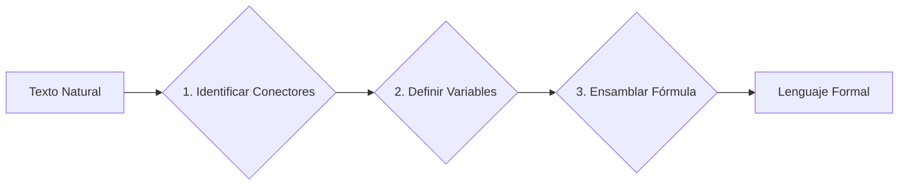

# 🛰️ El Incidente del Discovery One
### Proposición, Lenguaje Formal, Axiomas de Verdad y Jerarquía de Operadores

*Notas de clase — Matemáticas Discretas 1 · Módulo 1: Lógica Proposicional*
*Universidad de Antioquia · Ingeniería de Sistemas*

---

## Contexto de apoyo

A lo largo de este documento se emplea, como hilo narrativo de aplicación, un caso inspirado en la película **2001: Una Odisea del Espacio** (Stanley Kubrick, 1968). No es necesario haber visto la película para seguir las notas; a continuación se ofrece el contexto mínimo necesario.

> [!NOTE]
> **Para ampliar**: [2001: A Space Odyssey — Wikipedia](https://es.wikipedia.org/wiki/2001:_A_Space_Odyssey_(pel%C3%ADcula)) · [HAL 9000 — Wikipedia](https://es.wikipedia.org/wiki/HAL_9000)
>
> **Video corto (2-3 min)**: [Tráiler oficial](https://www.youtube.com/watch?v=UgGCScAV7qU)

**Dossier de la misión**:

| | |
|---|---|
| **Nave** | *Discovery One* |
| **Destino** | Júpiter |
| **Tripulación despierta** | David Bowman y Frank Poole (los demás tripulantes viajan hibernados) |
| **Sistema de a bordo** | **HAL 9000**, una computadora con capacidad de tomar decisiones sin consultar a los humanos, encargada de controlar los sistemas vitales de la nave |

## El caso

Semanas después de partir, HAL reporta un fallo inminente en la unidad AE-35, el componente que mantiene la antena de la nave alineada con la Tierra. Bowman inspecciona la unidad físicamente y no encuentra ningún fallo. Cuando Tierra analiza el mismo problema con un HAL gemelo, tampoco encuentra ningún error — lo cual resulta extraño, dado que la serie 9000 tiene un historial operativo perfecto.

Queda entonces una pregunta abierta: **¿HAL evaluó incorrectamente una condición lógica, o el error está en otra parte?**

Este documento presenta, en primer lugar, las herramientas teóricas necesarias para empezar a responder ese tipo de preguntas de forma rigurosa: qué es una proposición, cómo se traduce el lenguaje natural a fórmulas, qué establecen los axiomas de verdad de cada operador, y cómo se resuelve una expresión con varios operadores mediante la jerarquía. Tras cada bloque teórico se incluyen ejercicios resueltos de práctica general y, de manera independiente, un **Expediente** que retoma el caso del Discovery One y aplica lo aprendido para avanzar en su resolución.

---

# Parte I — Proposición y Lenguaje Formal

## 1.1 Del lenguaje natural a la proposición

Los seres humanos nos comunicamos mediante oraciones. Como recordará del colegio, toda oración se compone de un **sujeto** y un **predicado**. Sin embargo, no todas las oraciones cumplen la misma función comunicativa:

| Tipo | Intención comunicativa | Ejemplo |
|---|---|---|
| Declarativo | Informar o afirmar un hecho | "Pedro es el esposo de Vilma." |
| Interrogativo | Preguntar o solicitar información | "¿Dino es el perro de los Mármol?" |
| Imperativo | Ordenar o solicitar una acción | "¡Estudia para el examen!" |
| Exclamativo | Expresar emoción o sorpresa | "¡Qué día tan caluroso!" |

En este curso, y en lógica en general, solo nos interesan los enunciados **declarativos**: son los únicos a los que se les puede asignar, sin ambigüedad, un valor de verdad.

> [!TIP]
> **Definición: Proposición**
>
> Una **proposición** es todo enunciado declarativo al cual se le puede asignar, sin ambigüedad, un único valor de verdad.
>
> **Axioma de Bivalencia**: un enunciado puede ser **Verdadero ($V$)** o **Falso ($F$)**, pero nunca ambos a la vez ni ninguno de los dos.

**Ejemplo**: *"El número 7 es primo"* es una proposición (declarativa, con valor de verdad definido: $V$). *"¿Ya estudiaste para el parcial?"* no lo es (interrogativa, no afirma nada).

## 1.2 Lenguaje formal y proceso de traducción

El lenguaje natural es flexible pero ambiguo: una misma idea puede expresarse de muchas formas, y una misma frase puede interpretarse de varias maneras según el contexto. Para eliminar esa ambigüedad, la lógica traduce cada proposición a un **lenguaje formal**, construido con un conjunto pequeño de símbolos de significado fijo:

| Elemento | Símbolo | Función |
|---|:---:|---|
| Variables | $p, q, r, \ldots$ | Representan proposiciones simples |
| Operadores | $\neg, \land, \lor, \oplus, \rightarrow, \leftrightarrow$ | Combinan variables en proposiciones compuestas |
| Signos de agrupación | $(), []$ | Determinan la jerarquía y el orden de evaluación |

El proceso de traducir una oración del lenguaje natural a esta notación se resume en tres pasos:



1. **Identificar conectores**: subraye las palabras que indican relación lógica ("no", "y", "o", "si… entonces…", "si y solo si"…) y determine cuál es el conector principal.
2. **Definir variables**: separe la oración en proposiciones atómicas (sin conectores internos) y asígneles una letra.
3. **Ensamblar la fórmula**: sustituya cada proposición atómica por su variable y cada conector por su símbolo, verificando que los paréntesis reflejen la agrupación correcta.

**Ejemplo 1**: *"El estudiante aprueba el curso si entrega el proyecto final y asiste al menos al 80% de las clases."*

- Conector principal: "si… entonces…" ($\rightarrow$), con un "y" ($\land$) dentro del antecedente.
- $p$: Entrega el proyecto final. $\;\; q$: Asiste al menos al 80% de las clases. $\;\; r$: Aprueba el curso.
- **Expresión**: $(p \land q) \rightarrow r$

**Ejemplo 2**: *"No es cierto que el servidor esté apagado y el respaldo esté activo."*

- Conector principal: "no es cierto que" ($\neg$), aplicado a toda una conjunción.
- $p$: El servidor está apagado. $\;\; q$: El respaldo está activo.
- **Expresión**: $\neg(p \land q)$

**Ejemplo 3**: *"Puedes matricular la materia si y solo si cumples los prerrequisitos."*

- Conector principal: "si y solo si" ($\leftrightarrow$).
- $p$: Puedes matricular la materia. $\;\; q$: Cumples los prerrequisitos.
- **Expresión**: $p \leftrightarrow q$

> [!NOTE]
> **Conexión con Lógica y Representación I**: este proceso de traducción no es solo un ejercicio académico. Como futuro ingeniero, la habilidad que realmente se está entrenando aquí es la de **leer y comprender con precisión un requisito escrito en lenguaje natural** — un correo de un cliente, una historia de usuario, una especificación funcional — y convertirlo en una condición formal antes de escribir una sola línea de código. Un error de comprensión en el paso 1 (identificar mal el conector principal, pasar por alto una negación, agrupar mal con paréntesis) se traduce directamente en un `if` mal construido y en un error de lógica en el software.
>
> Matemáticas Discretas 1 es correquisito de Lógica y Representación I, curso en el que trabajará estas mismas ideas con Python: cada vez que convierta un requisito en una condición (`if`/`elif`/`else`), estará repitiendo exactamente este proceso de tres pasos.

---

# Parte II — Axiomas de Verdad

## 2.1 Elementos de formalización

Una **variable proposicional** ($p, q, r, \ldots$) representa un hecho con valor de verdad definido. Los **operadores** ($\neg, \land, \lor, \oplus, \rightarrow, \leftrightarrow$) permiten combinar variables para construir proposiciones compuestas. Los **signos de agrupación** ($(), []$) determinan el orden de evaluación cuando hay varios operadores en juego.

Estos elementos deben combinarse siguiendo **reglas de formación**, que determinan si una expresión está bien formada. Una variable sola ($p$) es una expresión válida; un operador binario aplicado a dos expresiones válidas ($p \land q$) también lo es. En cambio, una secuencia como $p \land \square$ (un operador sin su segundo operando) no es una expresión válida, porque no existe una forma de asignarle un valor de verdad.

## 2.2 Proposiciones simples y compuestas

Una proposición es **simple** (o atómica) cuando expresa un único hecho, sin conectores lógicos. Es **compuesta** (o molecular) cuando resulta de unir dos o más proposiciones simples mediante conectores.

**Ejemplo**: la afirmación *"Jacob y Esaú son hijos de Isaac"* es, pese a contener la palabra "y", una proposición **simple**: describe un único hecho verificable (una relación de parentesco), no dos proposiciones distintas. En cambio, *"Como Jacob le dio un plato de lentejas a su padre, obtuvo la primogenitura"* sí es **compuesta**: contiene una estructura condicional, $L \rightarrow S$, donde $L$ = "Jacob le da el plato de lentejas a su padre" y $S$ = "Jacob obtiene la primogenitura".

> [!TIP]
> **Compruebe su comprensión**
>
> Clasifique las siguientes proposiciones como simples o compuestas:
> 1. "El número 7 es primo."
> 2. "Llueve y hace frío."
>
> <details><summary>Ver respuesta</summary>
> (1) Simple: un único hecho. (2) Compuesta: dos hechos unidos por el conector "y" (conjunción).
> </details>

## 2.3 Paradojas y enunciados abiertos

No todo enunciado declarativo cumple el axioma de bivalencia visto en la Parte I. Considere la afirmación *"Esta oración es falsa"*. Si se denota como $Q$ y se supone $Q=V$, entonces lo que afirma es cierto, por lo que $Q$ debería ser falsa — contradicción. Si se supone $Q=F$, entonces lo que afirma es falso, por lo que $Q$ debería ser verdadera — otra contradicción. En consecuencia, $Q$ no admite un valor de verdad fijo: es una **paradoja**, no una proposición válida.

Existe otro tipo de enunciado que tampoco es proposición: el **enunciado abierto**, aquel que contiene variables sin un valor fijo asignado. Por ejemplo, "$x + y = z$" no puede clasificarse como verdadera ni falsa mientras $x$, $y$ y $z$ no tengan valores concretos.

> [!TIP]
> **Compruebe su comprensión**
>
> Explique por qué la oración "Esta afirmación no puede probarse ni refutarse" presenta el mismo tipo de problema que el ejemplo anterior.
>
> <details><summary>Ver respuesta</summary>
> Al igual que la paradoja del mentiroso, es una afirmación autorreferencial: cualquier intento de asignarle un valor de verdad fijo entra en conflicto con lo que la propia afirmación establece, violando el axioma de bivalencia.
> </details>

## 2.4 Los seis operadores lógicos

### Negación ($\neg p$)

Invierte el valor de verdad de una proposición.

| $p$ | $\neg p$ |
|:---:|:---:|
| V | F |
| F | V |

### Conjunción ($p \land q$)

Verdadera únicamente cuando ambas proposiciones son verdaderas.

| $p$ | $q$ | $p \land q$ |
|:---:|:---:|:---:|
| V | V | V |
| V | F | F |
| F | V | F |
| F | F | F |

> **Regla corta**: basta una falsedad para que toda la conjunción sea $F$.

### Disyunción ($p \lor q$)

Verdadera cuando al menos una de las proposiciones es verdadera.

> [!NOTE]
> En lógica, "o" es inclusivo — no el "o... o..." exclusivo que a veces implica el lenguaje cotidiano. $p \lor q$ es verdadera incluso cuando ambas proposiciones lo son.

| $p$ | $q$ | $p \lor q$ |
|:---:|:---:|:---:|
| V | V | V |
| V | F | V |
| F | V | V |
| F | F | F |

> **Regla corta**: basta una verdad para que toda la disyunción sea $V$.

### Disyunción exclusiva ($p \oplus q$)

Verdadera cuando las dos proposiciones tienen valores diferentes.

| $p$ | $q$ | $p \oplus q$ |
|:---:|:---:|:---:|
| V | V | F |
| V | F | V |
| F | V | V |
| F | F | F |

> **Regla corta**: valores diferentes dan $V$.

> [!TIP]
> **Compruebe su comprensión**
>
> Sean $p=V$ y $q=F$. Evalúe $\neg p \lor q$ y $p \oplus \neg q$.
>
> <details><summary>Ver respuesta</summary>
> $\neg p \lor q = F \lor F = F$. $\;\; p \oplus \neg q = V \oplus V = F$.
> </details>

### Condicional ($p \rightarrow q$)

Se lee "Antecedente $\rightarrow$ Consecuente". Según el contexto, también se conoce como Hipótesis $\rightarrow$ Tesis (en demostraciones) o Premisa $\rightarrow$ Conclusión (en argumentos).

| $p$ | $q$ | $p \rightarrow q$ |
|:---:|:---:|:---:|
| V | V | V |
| V | F | **F** |
| F | V | V |
| F | F | V |

> [!IMPORTANT]
> **Regla de oro**: el condicional solo es falso cuando el antecedente es verdadero y el consecuente es falso ($V \rightarrow F = F$). En cualquier otro caso es verdadero, incluso cuando el antecedente es falso.
>
> **Dicho en palabras**: una implicación es verdadera exactamente cuando el antecedente es falso, o el consecuente es verdadero.

**Ejemplo**: considere la afirmación *"Si Uribe gana las elecciones, entonces habrá paz"* ($W \rightarrow P$). En un escenario donde efectivamente gana ($W=V$) pero no hay paz ($P=F$): $W \rightarrow P = V \rightarrow F = F$, la implicación resulta falsa, porque se prometió algo que no se cumplió. En un escenario donde no gana ($W=F$) y tampoco hay paz ($P=F$): $W \rightarrow P = F \rightarrow F = V$, la implicación es verdadera, porque nunca se activó la condición que la haría exigible.

> [!WARNING]
> **Errores conceptuales frecuentes con el condicional**
>
> **1. Confundir el condicional con una relación de causa y efecto.** Considere $p$ = "Llueve" y $q$ = "La calle está mojada", con $p \rightarrow q$. Esto no significa que la lluvia sea la *causa* de que la calle esté mojada — solo describe una relación entre valores de verdad. La calle podría estar mojada por otra razón (un carro tanque de agua, por ejemplo) y la proposición $p \rightarrow q$ seguiría siendo verdadera si, cada vez que llueve, la calle también está mojada. El condicional no explica *por qué* ocurre algo; solo compara si dos hechos son consistentes entre sí.
>
> **2. Confundir $p \rightarrow q$ con su recíproco $q \rightarrow p$.** Estas dos expresiones **no** son equivalentes. Con el ejemplo anterior: $p \rightarrow q$ ("Si llueve, la calle está mojada") puede ser verdadera, mientras que $q \rightarrow p$ ("Si la calle está mojada, entonces llovió") puede ser falsa al mismo tiempo — la calle pudo mojarse por otra causa. Antes de dar por hecho que una implicación funciona "en ambos sentidos", verifique con una tabla de verdad si realmente es así; en general, no lo es.

### Bicondicional ($p \leftrightarrow q$)

Verdadero cuando ambas proposiciones comparten el mismo valor de verdad.

| $p$ | $q$ | $p \leftrightarrow q$ |
|:---:|:---:|:---:|
| V | V | V |
| V | F | F |
| F | V | F |
| F | F | V |

> [!TIP]
> **Compruebe su comprensión**
>
> Sean $p=F$, $q=V$, $r=F$. Evalúe $(p \rightarrow q) \leftrightarrow r$.
>
> <details><summary>Ver respuesta</summary>
> $p \rightarrow q = F \rightarrow V = V$. $\;\; V \leftrightarrow r = V \leftrightarrow F = F$.
> </details>

> [!NOTE]
> **Conexión con Lógica y Representación I**: este semestre, en el curso correquisito, usted trabaja en Python con estos mismos operadores, con otro nombre: la conjunción se escribe `and`, la disyunción `or`, la negación `not`. Por ejemplo, la expresión $(p \land \neg q) \lor r$ se vería así en Python:
>
> ```python
> if (p and not q) or r:
>     ...
> ```
>
> Es la misma estructura lógica, solo con otra notación — dominar una ayuda a dominar la otra. Más adelante, cuando trabaje con condicionales anidados en Lógica y Representación I (un `if` dentro de otro `if`), estará aplicando exactamente la jerarquía de operadores que se estudia en la Parte III de este documento.

---

# Parte III — Jerarquía de Operadores

## 3.1 Tabla de prioridad y asociatividad

Cuando una expresión compuesta no tiene suficientes signos de agrupación, se aplica un orden de precedencia fijo para evitar ambigüedad.

| Prioridad | Símbolo | Asociatividad | Ejemplo con paréntesis |
|:---:|:---:|:---:|---|
| 1 (más alta) | $\neg$ | No aplica (unitario) | $\neg p \land q \mapsto (\neg p) \land q$ |
| 2 | $\land$ | Izquierda | $p \land q \land r \mapsto (p \land q) \land r$ |
| 3 | $\lor$ | Izquierda | $p \lor q \lor r \mapsto (p \lor q) \lor r$ |
| 4 | $\oplus$ | Izquierda | $p \oplus q \oplus r \mapsto (p \oplus q) \oplus r$ |
| 5 | $\rightarrow$ | Derecha | $p \rightarrow q \rightarrow r \mapsto p \rightarrow (q \rightarrow r)$ |
| 6 (más baja) | $\leftrightarrow$ | Derecha | $p \leftrightarrow q \leftrightarrow r \mapsto p \leftrightarrow (q \leftrightarrow r)$ |

## 3.2 Método de evaluación paso a paso

Para evaluar una expresión con valores dados: (1) sustituya cada variable por su valor; (2) resuelva primero las negaciones; (3) continúe según el orden de precedencia de la tabla anterior, resolviendo de adentro hacia afuera cuando existan paréntesis anidados.

**Ejemplo**: dados $p=V$, $q=F$, $r=V$, evalúe $\neg p \lor q \rightarrow r$.

$\neg p = F$. $\;\; \neg p \lor q = F \lor F = F$. $\;\; F \rightarrow r = F \rightarrow V = V$. Resultado: $V$.

> [!TIP]
> **Compruebe su comprensión**
>
> Agregue los paréntesis correspondientes, según la jerarquía, a la expresión $p \lor q \land \neg r \rightarrow s$.
>
> <details><summary>Ver respuesta</summary>
> Primero $\neg r$; luego $\land$: $q \land (\neg r)$; luego $\lor$: $p \lor (q \land \neg r)$; luego $\rightarrow$: $\big(p \lor (q \land \neg r)\big) \rightarrow s$.
> </details>

---

# 📘 Ejercicios resueltos

A continuación se presentan los ejercicios resueltos correspondientes a los temas de las Partes I, II y III. Cada uno explica el razonamiento detrás de cada paso — no solo el resultado — para que pueda seguirlos como si estuviera junto a usted resolviéndolos.

### Bloque A — Traducción a lenguaje formal

**1. "Juan es estudiante de matemáticas pero no de ciencias de la computación."**

**Paso 1 — Identificar el conector principal.** La palabra "pero" cumple aquí la misma función lógica que "y": une dos afirmaciones sin alterar la estructura. El enunciado afirma dos cosas sobre Juan — que sí es estudiante de matemáticas, y que no es estudiante de ciencias de la computación —, así que es una conjunción.

**Paso 2 — Definir variables.**
- $p$: Juan es estudiante de matemáticas.
- $q$: Juan es estudiante de ciencias de la computación.

**Paso 3 — Ensamblar la fórmula.** La segunda proposición aparece negada ("no... de ciencias de la computación").

$$
p \land \neg q
$$

**2. "Ni hace calor ni está soleado."**

**Paso 1 — Identificar el conector principal.** La construcción "ni... ni..." niega ambas proposiciones a la vez y las une — equivale a decir "no hace calor y no está soleado".

**Paso 2 — Definir variables.**
- $h$: Hace calor.
- $s$: Está soleado.

**Paso 3 — Ensamblar la fórmula.**

$$
\neg h \land \neg s
$$

**3. "Este número es par o este número es impar."**

**Paso 1 — Identificar el conector principal.** "O" indica disyunción.

**Paso 2 — Definir variables.**
- $p$: El número es par.
- $q$: El número es impar.

**Paso 3 — Ensamblar la fórmula.**

$$
p \lor q
$$

> [!WARNING]
> **Error conceptual frecuente**: un entero no puede ser par e impar a la vez —son mutuamente excluyentes— lo que podría sugerir que aquí correspondería usar $\oplus$ en vez de $\lor$. Sin embargo, la convención de traducción es distinta: el "o" del lenguaje natural se traduce como disyunción inclusiva ($\lor$) salvo que el enunciado indique explícitamente exclusividad (por ejemplo, con la construcción "o... o..., pero no ambos"). La traducción $p \lor q$ es correcta como *traducción literal* del enunciado; que $p$ y $q$ no puedan ser verdaderas simultáneamente en este caso particular es una propiedad de los números (mutuamente excluyentes), no algo que cambie la regla de traducción del conector "o".

**4. "Si tiene una contraseña vigente, entonces puede iniciar sesión en la red."**

**Paso 1 — Identificar el conector principal.** La estructura "Si... entonces..." es la forma más directa del condicional: lo que sigue a "Si" es el antecedente, lo que sigue a "entonces" es el consecuente.

**Paso 2 — Definir variables.**
- $p$: Tiene una contraseña vigente.
- $q$: Puede iniciar sesión en la red.

**Paso 3 — Ensamblar la fórmula.**

$$
p \rightarrow q
$$

**5. "John batirá el récord mundial de la milla solo si corre la milla en menos de cuatro minutos."**

**Paso 1 — Identificar el conector principal.** La construcción "$p$ solo si $q$" es una trampa frecuente: no significa $q \rightarrow p$, aunque $q$ aparezca primero en la idea cronológicamente. "Solo si" siempre introduce la condición **necesaria** — es decir, el consecuente — por lo que la fórmula correcta es $p \rightarrow q$.

**Paso 2 — Definir variables.**
- $p$: John batirá el récord mundial de la milla.
- $q$: Corre la milla en menos de cuatro minutos.

**Paso 3 — Ensamblar la fórmula.**

$$
p \rightarrow q
$$

**6. "Este entero es par si, y solo si, es igual al doble de algún entero."**

**Paso 1 — Identificar el conector principal.** "Si, y solo si" es la marca textual del bicondicional.

**Paso 2 — Definir variables.**
- $p$: Este entero es par.
- $q$: Es igual al doble de algún entero.

**Paso 3 — Ensamblar la fórmula.**

$$
p \leftrightarrow q
$$

**7. "Si el pianista toca el concierto, entonces la gente vendrá si los precios no son demasiado altos."**

**Paso 1 — Identificar la estructura.** Hay dos condicionales anidados. El "Si... entonces..." externo tiene como antecedente "el pianista toca el concierto" y como consecuente toda la cláusula "la gente vendrá si los precios no son demasiado altos" — que es, a su vez, otro condicional.

**Paso 2 — Definir variables.**
- $p$: El pianista toca el concierto.
- $q$: La gente vendrá.
- $r$: Los precios son demasiado altos.

**Paso 3 — Traducir la cláusula interna.** "La gente vendrá si los precios no son demasiado altos" tiene la forma "$q$ si $\neg r$", que equivale a $\neg r \rightarrow q$.

**Paso 4 — Ensamblar la fórmula completa.**

$$
p \rightarrow (\neg r \rightarrow q)
$$

> [!TIP]
> **Antes de continuar, pregúntese**: ¿por qué la cláusula interna se tradujo como $\neg r \rightarrow q$ y no como $r \rightarrow q$?
>
> <details><summary>Ver respuesta</summary>
> Porque el enunciado dice "si los precios <b>no</b> son demasiado altos", es decir, la condición que activa "la gente vendrá" es la negación de $r$, no $r$ directamente.
> </details>

### Bloque B — Evaluación con axiomas de verdad

**8.** Sea $h$ una proposición verdadera ("Hace calor") y $s$ una proposición falsa ("El día está soleado"). Determine $\neg h \land s$ y $\neg h \land \neg s$.

**Paso 1 — Sustituir los valores conocidos.** $h=V$, $s=F$.

**Paso 2 — Evaluar $\neg h \land s$.**

$$
\begin{aligned}
\neg h \land s &= \neg V \land F \\
&= F \land F \\
&= \mathbf{F}
\end{aligned}
$$

**Paso 3 — Evaluar $\neg h \land \neg s$.**

$$
\begin{aligned}
\neg h \land \neg s &= F \land \neg F \\
&= F \land V \\
&= \mathbf{F}
\end{aligned}
$$

**9.** Determine el valor de verdad de $p \lor q \land \neg(p \land q)$ para dos asignaciones distintas de $p$ y $q$.

**Paso 1 — Decidir el orden (aplica a ambos casos).** La expresión tiene tres operadores: $\lor$, $\land$ y $\neg$. Antes de sustituir cualquier valor, conviene preguntarse: ¿cuál se resuelve primero? Por la tabla de jerarquía, $\neg$ tiene prioridad 1, $\land$ prioridad 2, y $\lor$ prioridad 3 — la más baja de las tres. Eso significa que el $\lor$ es el operador *principal*: todo lo que está a su derecha se resuelve primero, como si tuviera un paréntesis invisible.

$$
p \lor q \land \neg(p \land q) \;\;\equiv\;\; p \lor \Big(q \land \neg(p \land q)\Big)
$$

**Caso 1: $p=V, q=V$**

**Paso 2 — Resolver el paréntesis explícito.**

$$
\begin{aligned}
p \land q &= V \land V \\
&= V
\end{aligned}
$$

**Paso 3 — Aplicar la negación.**

$$
\begin{aligned}
\neg(p \land q) &= \neg V \\
&= F
\end{aligned}
$$

**Paso 4 — Resolver la conjunción interna.**

$$
\begin{aligned}
q \land \neg(p \land q) &= V \land F \\
&= F
\end{aligned}
$$

**Paso 5 — Resolver la disyunción principal.**

$$
\begin{aligned}
p \lor F &= V \lor F \\
&= \mathbf{V}
\end{aligned}
$$

**Caso 2: $p=V, q=F$** — mismo procedimiento del Paso 1, ahora con $q=F$.

$$
\begin{aligned}
p \land q &= V \land F \\
&= F
\end{aligned}
\qquad
\begin{aligned}
\neg(p \land q) &= \neg F \\
&= V
\end{aligned}
$$

$$
\begin{aligned}
q \land \neg(p \land q) &= F \land V \\
&= F
\end{aligned}
\qquad
\begin{aligned}
p \lor F &= V \lor F \\
&= \mathbf{V}
\end{aligned}
$$

### Bloque C — Deducción con jerarquía

**10.** Sean $P, Q, R$ proposiciones.

**(a)** Si $R \lor P$ y $Q \land P$ son falsas, y $P$ es falsa, ¿qué puede afirmarse de $Q$ y $R$?

**Paso 1 — Sustituir lo conocido.** $P=F$.

**Paso 2 — Analizar $R \lor P$.**

$$
\begin{aligned}
R \lor P &= R \lor F \\
&= R
\end{aligned}
$$

Como esta expresión debe ser falsa (dato del problema) y acabamos de mostrar que es equivalente a $R$ mismo, se concluye que $\mathbf{R=F}$.

**Paso 3 — Analizar $Q \land P$.**

$$
\begin{aligned}
Q \land P &= Q \land F \\
&= F
\end{aligned}
$$

Esta conjunción es falsa **sin importar el valor de $Q$** — la regla de dominación de la conjunción con $F$ ya garantiza el resultado antes de conocer $Q$. Por lo tanto, esta condición no aporta ninguna información adicional.

**Conclusión**: $R=F$; **el valor de $Q$ queda indeterminado.**

**(b)** Si $Q \rightarrow R \rightarrow P \land Q \lor R$ es falsa, ¿qué puede afirmarse de $P, Q, R$?

**Paso 1 — Agrupar por jerarquía.** El condicional asocia a la derecha, así que el segundo $\rightarrow$ se agrupa primero.

$$
Q \rightarrow R \rightarrow (P \land Q) \lor R \;\;\equiv\;\; Q \rightarrow \Big(R \rightarrow \big((P\land Q)\lor R\big)\Big)
$$

**Paso 2 — Plantear qué se necesitaría para que sea falsa.** Un condicional externo $Q\rightarrow(\ldots)$ es falso únicamente si $Q=V$ y la parte interna es falsa; a su vez, esa parte interna, $R\rightarrow(\ldots)$, es falsa únicamente si $R=V$ y $(P\land Q)\lor R$ es falso. Es decir, necesitaríamos que $R=V$ y, al mismo tiempo, $(P\land Q)\lor R = F$.

**Paso 3 — Verificar si eso es posible.**

$$
\begin{aligned}
(P\land Q)\lor R &= (P\land Q) \lor V \\
&= \mathbf{V}
\end{aligned}
$$

(por la regla de dominación de la disyunción: basta que uno de los dos lados sea $V$). Esto **contradice** lo que el Paso 2 exigía — que esa misma expresión fuera $F$.

**Conclusión**: no existe ninguna combinación de $P, Q, R$ que haga falsa la expresión completa — es **siempre verdadera**, sin importar sus valores.

> [!TIP]
> **Antes de continuar, pregúntese**: ¿por qué fue necesario descartar la posibilidad de que la expresión fuera falsa mediante un razonamiento completo, en lugar de probar un solo caso?
>
> <details><summary>Ver respuesta</summary>
> Porque evaluar un único caso solo demuestra que la expresión <i>puede</i> ser verdadera en esa situación particular; no demuestra que sea imposible que sea falsa. Para afirmar que una expresión es siempre verdadera se necesita mostrar que <b>ninguna</b> combinación de valores la hace falsa — ya sea revisando todos los casos posibles, o mediante un argumento por contradicción como el que se usó aquí.
> </details>

### Problema guiado

> [!TIP]
> Complete los pasos que faltan.
>
> Sean $p=V$, $q=F$. Evalúe $(p \lor q) \rightarrow \neg p$.
>
> **Paso 1 — Resolver el lado izquierdo del condicional.**
>
> $$
> \begin{aligned}
> p \lor q &= V \lor F \\
> &= V
> \end{aligned}
> $$
>
> **Paso 2 — Resolver el lado derecho.**
>
> $$
> \begin{aligned}
> \neg p &= \square
> \end{aligned}
> $$
>
> **Paso 3 — Resolver el condicional completo.**
>
> $$
> \begin{aligned}
> (p \lor q) \rightarrow \neg p &= V \rightarrow \square \\
> &= \square
> \end{aligned}
> $$
>
> <details><summary>Ver respuesta</summary>
>
> $$
> \begin{aligned}
> \neg p &= F
> \end{aligned}
> \qquad
> \begin{aligned}
> V \rightarrow F &= \mathbf{F}
> \end{aligned}
> $$
>
> </details>

---

# 📋 Expediente Discovery One — Fase 1

*Se retoma el caso planteado al inicio del documento, aplicando los conceptos de las Partes II y III.*

**Datos disponibles**:
- $H$: "HAL reporta un fallo en la unidad AE-35" (dato del caso: $H=V$, HAL efectivamente emitió este reporte).
- $D$: "La inspección física detecta un fallo real en la unidad" (dato del caso: $D=F$, Bowman no encontró ningún fallo).

**Pieza 1 — Negación**. La inspección de Bowman establece que $D$ es falsa. Aplicando negación, $\neg D$ = "la inspección no detecta ningún fallo" es verdadera ($\neg D = V$).

**Pieza 2 — Conjunción**. Suponga que el protocolo de la misión establece: *"El fallo se declara confirmado si HAL lo reporta y la inspección lo detecta"*, es decir $C = H \land D$. Evaluando: $C = V \land F = \mathbf{F}$. Según el protocolo, el fallo **no** queda confirmado.

**Pieza 3 — Condicional**. Suponga además la regla de seguridad: *"Si el fallo es confirmado, entonces se notifica a Tierra con prioridad alta"*, es decir $C \rightarrow N$. Dado que $C = F$ (Pieza 2), el condicional $C \rightarrow N$ es verdadero sin importar el valor de $N$, por la regla de oro del condicional (antecedente falso implica condicional verdadero). La regla de seguridad no fue violada, independientemente de si la notificación se envió o no.

**Pieza 4 — Expresión compuesta y jerarquía**. Se define la condición de anomalía como $A = H \land \neg D \land \neg C$ (HAL reporta el fallo, la inspección no lo detecta, y el fallo no está confirmado por protocolo). Evaluando con los datos disponibles: $A = V \land V \land \neg F = V \land V \land V = \mathbf{V}$.

La condición de anomalía se cumple: existe una discrepancia lógica real entre lo que HAL reporta y lo que el resto del sistema puede corroborar.

---

# 📋 Expediente Discovery One — Cierre de esta sesión

*Se retoma el análisis de la Fase 1.*

En la Fase 1 se evaluó la condición de anomalía $A = H \land \neg D \land \neg C$ (con $C = H \land D$) únicamente **para el caso observado**: $H=V$ (HAL reportó el fallo) y $D=F$ (Bowman no lo detectó). El resultado, $A=V$, confirma que en este caso puntual existe una discrepancia lógica.

Pero esto deja una pregunta sin responder: **¿qué tan robusto es este resultado?** Axiomas y jerarquía permiten evaluar una expresión para una asignación específica de valores, pero no permiten, por sí solos, confirmar qué ocurriría si $H$ o $D$ tomaran otros valores — por ejemplo, si en otro momento de la misión HAL *no* hubiera reportado el fallo, o si la inspección física *sí* lo hubiera detectado. Sin una manera sistemática de revisar **todas** las combinaciones posibles, no es posible afirmar si el escenario observado es la única situación en la que se produce una anomalía, o si existen otras.

**Cierre parcial**: por ahora, se puede afirmar que el caso puntual reportado sí constituye, formalmente, una anomalía. Queda pendiente el análisis exhaustivo — la herramienta para resolverlo, las **tablas de verdad**, es el tema de la siguiente sesión, donde se retomará este mismo caso hasta llegar a un veredicto definitivo.

---

# Parte IV — Ejercicios propuestos

A continuación se presentan ejercicios de autoevaluación. Se recomienda resolverlos antes de consultar el solucionario al final del documento.

### Traducción a lenguaje formal

**E1.** "El motor se apaga si la temperatura supera los 90 grados."

**E2.** "No es cierto que el escudo esté activo y la energía esté baja."

**E3.** "El piloto automático se activa si y solo si no hay entrada manual."

### Evaluación con axiomas y jerarquía

**E4.** Sean $p=V, q=F, r=V$. Evalúe $(p\land q)\lor\neg r$.

**E5.** Sean $p=F, q=V, r=F$. Evalúe $p\rightarrow(q\leftrightarrow r)$.

**E6.** Sean $A=V, B=V, C=F$. Evalúe $\neg A \lor B \land C \rightarrow A$.

### Casos aplicados

**E7.** "El acceso a la sala de máquinas se concede si el usuario es un oficial autorizado, o si hay una emergencia declarada y el usuario tiene entrenamiento básico." Formalice la condición de acceso ($o$: es oficial autorizado; $e$: hay emergencia declarada; $t$: tiene entrenamiento básico) y evalúe el caso: el usuario no es oficial, sí hay emergencia declarada, no tiene entrenamiento básico. ¿Se concede el acceso?

**E8.** "El sistema entra en modo seguro si y solo si detecta una falla crítica y no está en modo de mantenimiento." Formalice la condición ($f$: detecta falla crítica; $m$: está en modo de mantenimiento) y evalúe el caso: sí detecta falla crítica, sí está en modo de mantenimiento. ¿Se activa el modo seguro?

---

## Resultados de aprendizaje

Al finalizar este documento, usted debería ser capaz de:

- Reconocer una proposición y distinguirla de otros tipos de enunciados, aplicando el axioma de bivalencia.
- Traducir enunciados de lenguaje natural a lenguaje formal, y viceversa.
- Determinar el valor de verdad de una proposición compuesta aplicando los axiomas de verdad de los seis operadores lógicos.
- Evaluar expresiones lógicas complejas respetando el orden de precedencia y asociatividad de los operadores.
- Reconocer y evitar los errores conceptuales más frecuentes al interpretar el operador condicional (causalidad y confusión con el recíproco).

---

## Ficha de bolsillo

| Operador | Símbolo | Regla de oro |
|---|:---:|---|
| Negación | $\neg p$ | Invierte el valor. |
| Conjunción | $p\land q$ | Basta una falsedad para que todo sea $F$. |
| Disyunción | $p\lor q$ | Basta una verdad para que todo sea $V$. |
| Disyunción exclusiva | $p\oplus q$ | Valores diferentes dan $V$. |
| Condicional | $p\rightarrow q$ | Solo es $F$ cuando $V\rightarrow F$. |
| Bicondicional | $p\leftrightarrow q$ | $V$ cuando ambos coinciden. |

**Jerarquía** (de mayor a menor prioridad): $\neg \;>\; \land \;>\; \lor \;>\; \oplus \;>\; \rightarrow \;>\; \leftrightarrow$
($\land, \lor, \oplus$ asocian a la izquierda; $\rightarrow, \leftrightarrow$ asocian a la derecha)

**Proceso de traducción, 3 pasos**: identificar conectores → definir variables → ensamblar fórmula.

---

## Referencias y material para profundizar

Las siguientes fuentes son las que respaldan el contenido de este documento y del curso en general. Se incluye una breve nota sobre cada una para que usted pueda elegir según su nivel e idioma preferido.

### Notas del curso

- **Sitio de notas de clase de Matemáticas Discretas 1**: [discretas1-udea.github.io/discretas1-udea-20261](https://discretas1-udea.github.io/discretas1-udea-20261/). Sitio oficial del curso, actualmente **en construcción**: no todas las sesiones están publicadas todavía, y el contenido disponible puede cambiar a medida que avanza el semestre.

### Libros de texto del curso

- **Rosen, K. H.** *Discrete Mathematics and Its Applications* (8ª ed.). McGraw-Hill. Capítulo 1: "The Foundations: Logic and Proofs". Es el texto de referencia principal del curso; cubre exactamente los temas de este documento con muchos ejercicios adicionales.
- **Liben-Nowell, D.** *Connecting Discrete Mathematics and Computer Science*. Cambridge University Press. Presenta los mismos conceptos con un enfoque más aplicado a ciencias de la computación, útil para ver la conexión directa con programación.

### Material web de universidades

- **MIT OpenCourseWare — 6.042J, Mathematics for Computer Science**: [ocw.mit.edu/courses/6-042j-mathematics-for-computer-science-fall-2010](https://ocw.mit.edu/courses/6-042j-mathematics-for-computer-science-fall-2010/). Curso completo y gratuito del MIT; la unidad "1.4 Logic & Propositions" incluye diapositivas y apuntes en PDF sobre operadores proposicionales y tablas de verdad. En inglés.
- **Stanford CS103 — Mathematical Foundations of Computing, Lección 3: Propositional Logic**: [web.stanford.edu/class/archive/cs/cs103/cs103.1234/lectures/03](https://web.stanford.edu/class/archive/cs/cs103/cs103.1234/lectures/03/). Explica los mismos operadores y la traducción de lenguaje natural a lógica formal, con ejemplos adicionales de traducción. En inglés.
- **Universidad EAFIT — Lógica proposicional (documento de referencia en español)**: [repository.eafit.edu.co](https://repository.eafit.edu.co/server/api/core/bitstreams/80f3bcca-f425-4529-befa-f3942c57f902/content). Documento en español con un desarrollo formal similar al del curso; útil si se prefiere consultar en español antes de pasar a las fuentes en inglés.

> [!NOTE]
> Si el acceso a internet es limitado, no es necesario consultar estas fuentes para completar el curso — el contenido de este documento y de las clases es suficiente. Están aquí únicamente para quien desee profundizar por su cuenta.

---

## Solucionario — Parte IV

<details>
<summary><b>Presione aquí para ver las respuestas</b></summary>

**E1.** $t \rightarrow m$ (t: la temperatura supera los 90 grados; m: el motor se apaga)

**E2.** $\neg(e \land b)$ (e: el escudo está activo; b: la energía está baja)

**E3.** $a \leftrightarrow \neg m$ (a: el piloto automático se activa; m: hay entrada manual)

**E4.** $(p\land q)\lor\neg r = (V\land F)\lor\neg V = F\lor F = \mathbf{F}$

**E5.** $p\rightarrow(q\leftrightarrow r) = F \rightarrow (V\leftrightarrow F) = F\rightarrow F = \mathbf{V}$

**E6.** $\neg A\lor B\land C \rightarrow A$, agrupado como $(\neg A \lor (B\land C))\rightarrow A$: $\neg A=F$; $B\land C = V\land F=F$; $F\lor F=F$; $F\rightarrow A = F\rightarrow V = \mathbf{V}$

**E7.** $o \lor (e\land t)$. Evaluado con $o=F, e=V, t=F$: $F\lor(V\land F) = F\lor F = \mathbf{F}$. **No se concede el acceso.**

**E8.** $f \land \neg m$. Evaluado con $f=V, m=V$: $V\land\neg V = V\land F = \mathbf{F}$. **No se activa el modo seguro.**

</details>