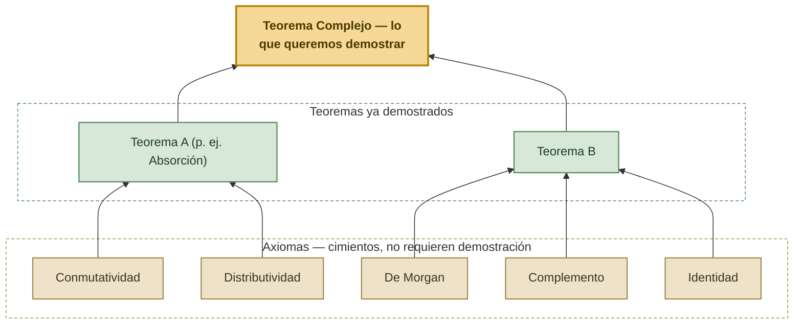

# 🕵️ El Caso del Broche de Zafiro — La Ecuación de Holmes
### Enfoque Axiomático: Leyes del Álgebra de Proposiciones y Demostraciones por Cadena de Equivalencias

*Notas de clase — Matemáticas Discretas 1 · Módulo 1: Lógica Proposicional*
*Universidad de Antioquia · Ingeniería de Sistemas*

---

## El caso — donde lo dejamos

Con las herramientas de la sesión anterior, Holmes descartó a Lady Constance, encontró que las declaraciones del Coronel Whitmore y de la Srta. Hart son negaciones exactas la una de la otra, y estableció que ni el acceso a una llave ($L$) ni haberse ausentado del salón ($F$) son, por separado, prueba suficiente de culpabilidad ($R$) — apenas son condiciones necesarias. El caso quedó acotado a dos sospechosos: el Sr. Finch y el Coronel Whitmore. *"Tengo las piezas"*, dijo Holmes, *"pero todavía no la ecuación que las una."*

Esta sesión le da esa ecuación: un conjunto de leyes que permiten combinar y simplificar todas las condiciones lógicas recogidas hasta ahora en una sola expresión, sin construir una tabla de verdad gigantesca para hacerlo.

## Antes de comenzar — lo que ya debería saber

Este documento retoma directamente las herramientas de la sesión anterior. Antes de continuar, verifique que puede hacer lo siguiente:

- Construir la tabla de verdad de una expresión con cualquier número de variables y clasificarla como **tautología**, **contradicción** o **contingencia**.
- Demostrar que dos proposiciones son **equivalentes** ($p\equiv q$) verificando que $p\leftrightarrow q$ es una tautología.
- Aplicar la **definición del condicional** ($p\rightarrow q\equiv\neg p\lor q$) y las **Leyes de De Morgan** ($\neg(p\land q)\equiv\neg p\lor\neg q$, $\neg(p\lor q)\equiv\neg p\land\neg q$).
- Reconocer el **contrarrecíproco** ($p\rightarrow q\equiv\neg q\rightarrow\neg p$) y distinguirlo del recíproco (no equivalente al original).

Si alguno de estos puntos no le resulta claro, repáselo en el documento de la sesión anterior antes de continuar. Este documento no depende de conexión a internet para poder estudiarlo — todo lo necesario está aquí.

---

# Parte I — Del Álgebra Escolar al Álgebra de Proposiciones

Seguramente, en el colegio resolvió ejercicios de simplificación como el siguiente:

> **Simplifique:** $\dfrac{x^2-x-6}{x^2-9}$

Para resolverlo, usted no probó valores de $x$ al azar. Aplicó una regla estructural ya demostrada como válida (factorización):

$$
\begin{aligned}
\frac{x^2-x-6}{x^2-9} &= \frac{(x-3)(x+2)}{(x-3)(x+3)} &&\text{(factorización de ambos polinomios)}\\
&= \frac{x+2}{x+3} &&\text{(cancelación del factor común }(x-3)\text{)}
\end{aligned}
$$

Note lo importante: aplicando reglas que ya sabía verdaderas, transformó una expresión en otra **equivalente y más simple**, sin evaluar $x$ ni una sola vez.

En lógica proposicional vamos a hacer exactamente lo mismo. Cambian las fichas —variables proposicionales ($p,q,r$) en vez de numéricas, y $\land,\lor,\neg,\rightarrow$ en vez de $+,-,\times,\div$— pero el juego es idéntico: aplicar reglas ya demostradas para transformar una expresión en otra equivalente, sin evaluar cada combinación de valores de verdad.

## I.1 ¿Por qué necesitamos esto?

Hasta ahora, la única forma que conoce para verificar una equivalencia es construir la tabla de verdad completa (el **enfoque basado en modelos**). Es un método infalible, pero se vuelve impráctico muy rápido: una expresión con 4 variables ya necesita $2^4=16$ filas; con 6 variables, 64 filas. Necesitamos una forma de simplificar y demostrar sin fuerza bruta.

## I.2 El enfoque axiomático — la analogía del edificio

Alrededor del año 300 a. C., Euclides organizó gran parte de la geometría griega partiendo de un pequeño conjunto de verdades que se aceptaban sin demostración —los **axiomas**— y, mediante deducción lógica pura, construyó a partir de ellos resultados cada vez más complejos —los **teoremas**. Cada teorema nuevo se apoya en axiomas o teoremas ya establecidos; nunca se construye desde cero.

Un sistema axiomático se puede imaginar como un edificio:

En nuestro caso, los **axiomas** son un conjunto de leyes lógicas que ya sabemos verdaderas (varias de ellas las demostramos con tabla de verdad en la sesión anterior). Una **demostración axiomática** consiste en partir de una expresión y transformarla, paso a paso, aplicando siempre una de estas leyes, hasta llegar a la expresión que queremos:

$$
\begin{array}{rl}
A & \equiv A_1 \\
  & \equiv A_2 \\
  & \quad\vdots \\
  & \equiv A_n \\
  & \equiv B \\
\hline
A & \equiv B
\end{array}
$$

Cada $\equiv$ de la cadena debe estar justificado por una ley concreta — nunca por intuición.

> [!NOTE]
> **Conexión con Lógica y Representación I**: simplificar una expresión booleana con estas leyes es exactamente lo que hace que una condición compleja en código sea más legible y eficiente. Un `if` con cinco operadores anidados casi siempre puede reducirse aplicando las mismas leyes que va a aprender aquí — verá un ejemplo concreto en los Ejercicios propuestos.

---

# Parte II — Inventario de Leyes del Álgebra de Proposiciones

La siguiente tabla es la **fuente de verdad** del curso para justificar pasos en talleres y exámenes. Ya conocía nueve de estas leyes desde la sesión anterior (donde se presentaron como "adelanto"); ahora se añaden tres más que formalizan lo que ya usó allí de forma intuitiva: Implicación, Contrarrecíproco y Equivalencia.

| Nombre | Forma con $\land$ | Forma con $\lor$ |
|---|:---:|:---:|
| Conmutatividad | $p\land q\equiv q\land p$ | $p\lor q\equiv q\lor p$ |
| Asociatividad | $(p\land q)\land r\equiv p\land(q\land r)$ | $(p\lor q)\lor r\equiv p\lor(q\lor r)$ |
| Distributividad | $p\land(q\lor r)\equiv(p\land q)\lor(p\land r)$ | $p\lor(q\land r)\equiv(p\lor q)\land(p\lor r)$ |
| Idempotencia | $p\land p\equiv p$ | $p\lor p\equiv p$ |
| Doble negación | $\neg(\neg p)\equiv p$ | (aplica igual, no depende de $\land$/$\lor$) |
| Leyes de De Morgan | $\neg(p\land q)\equiv\neg p\lor\neg q$ | $\neg(p\lor q)\equiv\neg p\land\neg q$ |
| Identidad | $p\land V\equiv p$ | $p\lor F\equiv p$ |
| Dominación | $p\land F\equiv F$ | $p\lor V\equiv V$ |
| Absorción | $p\land(p\lor q)\equiv p$ | $p\lor(p\land q)\equiv p$ |
| Complemento | $p\land\neg p\equiv F$ | $p\lor\neg p\equiv V$ |
| Implicación | $p\rightarrow q\equiv\neg p\lor q$ | — |
| Contrarrecíproco | $p\rightarrow q\equiv\neg q\rightarrow\neg p$ | — |
| Equivalencia | $p\leftrightarrow q\equiv(p\rightarrow q)\land(q\rightarrow p)$ | — |

> [!IMPORTANT]
> **Todas las leyes son de doble vía.** Cada $\equiv$ se puede leer de izquierda a derecha (para "expandir" una expresión) o de derecha a izquierda (para "factorizar" o compactar). La Distributividad leída de derecha a izquierda, por ejemplo, es precisamente cómo se factoriza una expresión — la usará así en varios de los ejercicios de esta sesión.

Para orientarse dentro de la tabla, es útil agrupar las leyes mentalmente en tres familias: las que gobiernan cómo interactúan $\land$ y $\lor$ entre sí (Conmutatividad, Asociatividad, Distributividad, Idempotencia, Absorción), las que gobiernan la negación (Doble negación, De Morgan, Complemento), y las que traducen flechas ($\rightarrow,\leftrightarrow$) a los operadores básicos (Implicación, Contrarrecíproco, Equivalencia) — casi siempre conviene aplicar estas últimas primero, para quedarse trabajando solo con $\land,\lor,\neg$.

> [!WARNING]
> **Distributividad no es Absorción.** Es un error frecuente confundirlas porque ambas involucran un paréntesis con una variable repetida. La Distributividad **expande** (rompe un paréntesis en dos términos): $p\land(q\lor r)\to(p\land q)\lor(p\land r)$. La Absorción **reduce drásticamente** (elimina el paréntesis completo): $p\land(p\lor q)\to p$. Antes de aplicar una, verifique si la variable que se repite es la *misma* en ambos lugares (señal de Absorción) o si son variables *distintas* (señal de Distributividad).

> [!TIP]
> **Compruebe su comprensión**
>
> Simplifique $\neg p\lor(\neg p\land q)$ usando una sola ley.
>
> 

Ver respuesta

> 
> Por Absorción, con $\neg p$ en el rol de "$p$" y $q$ en el rol de "$q$" de la tabla ($p\lor(p\land q)\equiv p$): $\neg p\lor(\neg p\land q)\equiv\neg p$.
> 
> 

---

# Parte III — Cómo se Escribe una Demostración Axiomática

Existen dos formas de escribir una demostración:

1. **En prosa**, encadenando cada transformación en un párrafo continuo. Es la forma estándar en libros universitarios, pero exige mayor claridad de redacción para no perder al lector.
2. **Afirmación–Razón** (formato de dos columnas): cada paso se numera, y junto a él se escribe explícitamente qué ley se aplicó y sobre qué operador. Es la forma más usada en cursos introductorios de lógica porque hace explícita y verificable cada transformación.

> [!IMPORTANT]
> **A partir de esta sesión, el formato Afirmación–Razón es el oficial del curso** para justificar demostraciones en talleres y exámenes. Úselo así:
>
> | # | Afirmación | Razón |
> |:---:|:---:|---|
> | 1 | expresión original | Hipótesis |
> | 2 | expresión transformada | Nombre de la ley, indicando sobre qué operador ($\land$/$\lor$) y en qué paso anterior |
> | $\vdots$ | $\vdots$ | $\vdots$ |
> | $n$ | expresión final | Nombre de la ley |

## III.1 Ejemplo ilustrativo: demostrar la Ley de Absorción

Antes de usar la tabla de leyes para demostrar cosas nuevas, es razonable preguntarse: ¿y esas leyes, cómo se sabe que son ciertas? Tómelo con la ley de Absorción para la conjunción: $P\land(P\lor Q)\equiv P$.

**Por el enfoque basado en modelos** (repaso rápido, ya lo domina):

| $P$ | $Q$ | $P\lor Q$ | $P\land(P\lor Q)$ |
|:---:|:---:|:---:|:---:|
| 0 | 0 | 0 | 0 |
| 0 | 1 | 1 | 0 |
| 1 | 0 | 1 | 1 |
| 1 | 1 | 1 | 1 |

La columna final coincide exactamente con la columna de $P$ en las cuatro filas: confirmado, $P\land(P\lor Q)\equiv P$.

**Por el enfoque axiomático** — usando *otras* leyes de la tabla (nunca la propia Absorción, para no caer en un razonamiento circular):

**Paso 1 — Romper el paréntesis.** $P\land(P\lor Q)$ tiene la forma $p\land(q\lor r)$, así que aplicamos Distributividad para separarlo en dos términos que podamos manipular por separado.

**Paso 2 — Reducir el término repetido.** El primer término, $P\land P$, es una variable multiplicada por sí misma: aplicamos Idempotencia.

**Paso 3 — Reescribir $P$ para poder factorizar de nuevo.** Usamos Identidad *en sentido inverso* ($P\equiv P\land V$) para poder volver a sacar $P$ como factor común en el siguiente paso.

**Paso 4 — Factorizar y cerrar.** Aplicamos Distributividad en sentido inverso (factorización), luego Dominación ($V\lor Q\equiv V$) y finalmente Identidad para llegar a $P$.

| # | Afirmación | Razón |
|:---:|:---:|---|
| 1 | $P\land(P\lor Q)$ | Hipótesis |
| 2 | $(P\land P)\lor(P\land Q)$ | Distributividad del $\land$ sobre el $\lor$ en (1) |
| 3 | $P\lor(P\land Q)$ | Idempotencia del $\land$ en (2) |
| 4 | $(P\land V)\lor(P\land Q)$ | Identidad del $\land$ (reescritura de $P$) en (3) |
| 5 | $P\land(V\lor Q)$ | Distributividad (factorización) en (4) |
| 6 | $P\land V$ | Dominación del $\lor$ en (5) |
| 7 | $P$ | Identidad del $\land$ en (6) |

$$\therefore\; P\land(P\lor Q)\equiv P$$

---

# 📘 Ejercicios resueltos

**1. Demuestre que $\neg\bigl(p\lor(\neg p\land q)\bigr)$ es lógicamente equivalente a $\neg p\land\neg q$.**

**Paso 1 — Identificar la estructura externa.** Toda la expresión está negada por fuera de una disyunción ($p\lor\cdots$), así que el primer movimiento natural es De Morgan sobre esa disyunción.

**Paso 2 — Simplificar lo que queda dentro.** Tras el primer De Morgan aparece una segunda negación, esta vez sobre una conjunción — se resuelve con una segunda aplicación de De Morgan, seguida de doble negación.

**Paso 3 — Distribuir y cerrar.** Con la expresión ya solo en términos de $\land,\lor,\neg$, distribuir revela un término que es un Complemento ($F$), y la Identidad limpia el resto.

| # | Afirmación | Razón |
|:---:|:---:|---|
| 1 | $\neg\bigl(p\lor(\neg p\land q)\bigr)$ | Hipótesis |
| 2 | $\neg p\land\neg(\neg p\land q)$ | De Morgan para el $\lor$ en (1) |
| 3 | $\neg p\land\bigl(\neg(\neg p)\lor\neg q\bigr)$ | De Morgan para el $\land$ en (2) |
| 4 | $\neg p\land(p\lor\neg q)$ | Doble negación en (3) |
| 5 | $(\neg p\land p)\lor(\neg p\land\neg q)$ | Distributividad del $\land$ sobre el $\lor$ en (4) |
| 6 | $F\lor(\neg p\land\neg q)$ | Complemento del $\land$ en (5) |
| 7 | $\neg p\land\neg q$ | Identidad del $\lor$ en (6) |

$$\therefore\;\neg\bigl(p\lor(\neg p\land q)\bigr)\equiv\neg p\land\neg q$$

**2. Demuestre que $(p\land q)\rightarrow(q\lor p)$ es una tautología.**

**Paso 1 — Eliminar la flecha.** Nada en la tabla de leyes opera directamente sobre $\rightarrow$; el primer paso, casi siempre, es aplicar Implicación para dejar la expresión solo en términos de $\land,\lor,\neg$.

**Paso 2 — Abrir la negación de la conjunción.** El antecedente negado, $\neg(p\land q)$, se abre con De Morgan.

**Paso 3 — Reagrupar para encontrar un Complemento.** Reordenando con Conmutatividad y Asociatividad aparecen dos pares de la forma $x\lor\neg x$, cada uno un Complemento que colapsa a $V$.

| # | Afirmación | Razón |
|:---:|:---:|---|
| 1 | $(p\land q)\rightarrow(q\lor p)$ | Hipótesis |
| 2 | $\neg(p\land q)\lor(q\lor p)$ | Implicación en (1) |
| 3 | $(\neg p\lor\neg q)\lor(q\lor p)$ | De Morgan para el $\land$ en (2) |
| 4 | $(\neg p\lor p)\lor(\neg q\lor q)$ | Conmutatividad y Asociatividad en (3) |
| 5 | $V\lor V$ | Complemento del $\lor$ (dos veces) en (4) |
| 6 | $V$ | Dominación del $\lor$ en (5) |

$$\therefore\;(p\land q)\rightarrow(q\lor p)\equiv V \quad\text{(es una tautología)}$$

> [!TIP]
> **Antes de continuar, pregúntese**: ¿por qué casi siempre conviene aplicar Implicación como primer paso al demostrar algo sobre un condicional?
>
> 

Ver respuesta

> 
> Porque ninguna otra ley de la tabla opera directamente sobre $\rightarrow$ o $\leftrightarrow$ — todas trabajan con $\land,\lor,\neg$. Mientras la flecha siga presente, la expresión queda "congelada"; convertirla primero es lo que habilita el resto de la cadena.
> 
> 

**3. Demuestre que $p\rightarrow(q\rightarrow r)\equiv(p\land q)\rightarrow r$.**

**Paso 1 — Eliminar ambas flechas.** Hay dos condicionales anidados; se aplica Implicación primero al externo, luego al interno.

**Paso 2 — Reagrupar y factorizar de vuelta a una flecha.** Una vez todo está en $\land,\lor,\neg$, Asociatividad permite agrupar $\neg p\lor\neg q$, que por De Morgan (en sentido inverso, es decir, factorización) se convierte en $\neg(p\land q)$ — dejando la expresión lista para reescribirse como un único condicional.

| # | Afirmación | Razón |
|:---:|:---:|---|
| 1 | $p\rightarrow(q\rightarrow r)$ | Hipótesis |
| 2 | $\neg p\lor(q\rightarrow r)$ | Implicación (externa) en (1) |
| 3 | $\neg p\lor(\neg q\lor r)$ | Implicación (interna) en (2) |
| 4 | $(\neg p\lor\neg q)\lor r$ | Asociatividad en (3) |
| 5 | $\neg(p\land q)\lor r$ | De Morgan (factorización) en (4) |
| 6 | $(p\land q)\rightarrow r$ | Implicación (en sentido inverso) en (5) |

$$\therefore\; p\rightarrow(q\rightarrow r)\equiv(p\land q)\rightarrow r$$

**4. Demuestre que $\bigl[P\rightarrow(Q\lor\neg R)\bigr]\equiv\bigl[(R\land P)\rightarrow Q\bigr]$.**

**Paso 1 — Eliminar la flecha e independizar los términos.** Implicación primero; luego Conmutatividad y Asociatividad para dejar $\neg R$ y $\neg P$ juntos, listos para factorizar.

**Paso 2 — Factorizar con De Morgan y volver a cerrar en una flecha.** $\neg R\lor\neg P$ se factoriza (De Morgan de derecha a izquierda) como $\neg(R\land P)$, y el resultado se reescribe como condicional.

| # | Afirmación | Razón |
|:---:|:---:|---|
| 1 | $P\rightarrow(Q\lor\neg R)$ | Hipótesis |
| 2 | $\neg P\lor(Q\lor\neg R)$ | Implicación en (1) |
| 3 | $\neg R\lor\neg P\lor Q$ | Conmutatividad en (2) |
| 4 | $(\neg R\lor\neg P)\lor Q$ | Asociatividad en (3) |
| 5 | $\neg(R\land P)\lor Q$ | De Morgan (factorización) en (4) |
| 6 | $(R\land P)\rightarrow Q$ | Implicación en (5) |

$$\therefore\;\bigl[P\rightarrow(Q\lor\neg R)\bigr]\equiv\bigl[(R\land P)\rightarrow Q\bigr]$$

**5. Verdadero o falso: "La negación de 'Si Susana es la madre de Luis, entonces Ali es su primo' es 'Si Susana es la madre de Luis, entonces Ali no es su primo'".**

**Paso 1 — Formalizar.** Sea $M$: "Susana es la madre de Luis" y $P$: "Ali es primo de Luis". El enunciado original es $M\rightarrow P$. Lo que el ejercicio propone como su negación es $M\rightarrow\neg P$. La pregunta real es: ¿$\neg(M\rightarrow P)\equiv M\rightarrow\neg P$?

**Paso 2 — Transformar $\neg(M\rightarrow P)$ con las leyes.** Se aplica Implicación y luego De Morgan con doble negación.

| # | Afirmación | Razón |
|:---:|:---:|---|
| 1 | $\neg(M\rightarrow P)$ | Hipótesis |
| 2 | $\neg(\neg M\lor P)$ | Implicación en (1) |
| 3 | $\neg(\neg M)\land\neg P$ | De Morgan para el $\lor$ en (2) |
| 4 | $M\land\neg P$ | Doble negación en (3) |

Entonces $\neg(M\rightarrow P)\equiv M\land\neg P$ — una **conjunción**, no un condicional.

**Paso 3 — Comparar contra la propuesta del enunciado.** La propuesta era $M\rightarrow\neg P$, que por Implicación equivale a $\neg M\lor\neg P$ — una disyunción distinta a $M\land\neg P$.

| $M$ | $P$ | $M\land\neg P$ | $\neg M\lor\neg P$ |
|:---:|:---:|:---:|:---:|
| 0 | 0 | 0 | **1** |
| 0 | 1 | 0 | 1 |
| 1 | 0 | 1 | 1 |
| 1 | 1 | 0 | 0 |

En la primera fila ($M=0,P=0$) las columnas difieren: $0\neq 1$. Basta ese único contraejemplo para descartar la equivalencia.

**Resultado: la afirmación es Falsa.** La negación de un condicional nunca es otro condicional — es la conjunción del antecedente con la negación del consecuente ($\neg(p\rightarrow q)\equiv p\land\neg q$, exactamente lo obtenido en el Paso 2). Es el mismo tipo de error que la falacia de afirmación del consecuente vista la sesión anterior: la intuición sugiere una forma "simétrica", pero las leyes muestran que la estructura real es distinta.

---

> [!TIP]
> **Problema guiado**
>
> Simplifique $(p\rightarrow q)\land(p\land\neg q)$.
>
> **Paso 1 — Eliminar la flecha.** Por Implicación: $(\neg p\lor q)\land(p\land\neg q)$.
>
> **Paso 2 — Distribuir sobre el segundo factor.** Por Distributividad (con $(p\land\neg q)$ como el término que se reparte): $\bigl[\neg p\land(p\land\neg q)\bigr]\lor\bigl[q\land(p\land\neg q)\bigr]$.
>
> **Paso 3 — Simplificar cada mitad por separado.** En la primera mitad, reagrupando con Asociatividad y Conmutatividad, aparece $\neg p\land p$; en la segunda, $q\land\neg q$. Ambos son Complemento: cada mitad colapsa a $F$.
>
> **Paso 4 — Complete usted el último paso.** Con ambas mitades en $F$, la expresión completa es $F\lor F$. ¿Qué ley aplica aquí, y a qué se simplifica?
>
> 

Ver respuesta

> 
> Por Idempotencia del $\lor$ (o, equivalentemente, Dominación): $F\lor F\equiv F$. La expresión original es una <strong>contradicción</strong>.
> 
> 

---

# 🕵️ Expediente del Broche de Zafiro — La Ecuación

Holmes reúne lo que ya tiene formalizado: tener acceso a una llave ($L$) es necesaria para el robo ($R$), y haberse ausentado del salón ($F$) también es necesaria para $R$. Si ambas condiciones son, cada una por separado, necesarias para $R$, entonces $R$ solo puede ser cierto si **las dos** lo son a la vez:

$$R\rightarrow(L\land F)$$

*"Esto no es una simple reescritura con nuestras leyes de hoy"*, advierte Holmes a Watson, *"es un paso deductivo distinto — combinar dos condiciones necesarias en una sola. La próxima sesión le pondrá nombre formal a este tipo de razonamiento."*

Pero lo que sí puede hacer con las herramientas de hoy es transformar esa expresión en algo más útil, aplicando el Contrarrecíproco:

$$R\rightarrow(L\land F) \;\equiv\; \neg(L\land F)\rightarrow\neg R$$

*"Ahí está mi ecuación"*, dice Holmes. *"Si puedo demostrar que un sospechoso no tuvo, a la vez, la llave y la ausencia del salón, queda descartado de inmediato."*

El problema es aplicarla: para Finch, el Coronel Whitmore y la Srta. Hart dieron declaraciones que son negaciones exactas la una de la otra sobre precisamente $L\land F$ — no hay forma de saber, solo con eso, si la conjunción es verdadera o falsa para él. Y para el propio Whitmore, su ausencia de la escena ($\neg F$) solo está atestiguada por la Srta. Hart, cuya palabra ya está en entredicho.

*"Tengo la ecuación correcta"*, concluye Holmes, guardando su libreta, *"pero no una forma de decidir, entre dos testimonios que se contradicen, cuál sostiene el peso de una conclusión. Eso no es álgebra de proposiciones — es validez de argumentos. Y ahí es exactamente donde debo mirar a continuación."*

---

# Ejercicios propuestos

**P1.** Simplifique: $(p\land q)\lor(p\land\neg q)$

**P2.** Simplifique: $\neg(\neg p\land\neg q)\lor(p\land q)$

**P3.** Demuestre que $\bigl[(p\rightarrow q)\land p\bigr]\rightarrow q$ es una tautología.

**P4.** Demuestre que $(p\land\neg p)\rightarrow q$ es una tautología.

**P5.** Simplifique: $p\lor(\neg p\land q)$

**P6.** Demuestre que $\neg(p\leftrightarrow q)\equiv(p\land\neg q)\lor(\neg p\land q)$

**P7.** Un programa está escrito así: *"El sistema lanza una excepción si el archivo no existe o si los permisos son inválidos, a menos que el modo de recuperación esté activo."* Defina las proposiciones simples, formalice la condición, y simplifique el antecedente usando De Morgan hasta dejarlo con el menor número de operadores posible.

**P8.** Determine, usando el enfoque axiomático, si $(p\rightarrow q)\lor(q\rightarrow p)$ es una tautología, una contradicción o una contingencia.

**P9.** Simplifique: $(p\lor q)\land(\neg p\lor q)$

**P10.** Reescriba $\neg q\rightarrow(\neg p\lor r)$ como un condicional cuyo antecedente sea $p\land\neg r$, usando De Morgan y Contrarrecíproco.

---

## Resultados de aprendizaje

Al finalizar este documento, usted debería ser capaz de:

- Aplicar las leyes del álgebra de proposiciones para simplificar expresiones lógicas sin construir tablas de verdad.
- Elaborar demostraciones de equivalencias lógicas usando el formato Afirmación–Razón.
- Justificar cuándo conviene el enfoque basado en modelos (tablas) y cuándo el enfoque axiomático (leyes), y alternar entre ambos con soltura.
- Demostrar que una expresión es tautología o contradicción mediante una cadena de equivalencias, sin evaluar cada fila.
- Reconocer que simplificar una expresión booleana con estas leyes es la misma habilidad que hace legible y eficiente una condición compuesta en código.

## Ficha de bolsillo

**Regla de oro**: si hay una flecha ($\rightarrow,\leftrightarrow$), conviértala primero (Implicación / Equivalencia) — ninguna otra ley opera sobre ella directamente.

**Las 13 leyes** (todas de doble vía — sirven para expandir o para factorizar):

Conmutatividad · Asociatividad · Distributividad · Idempotencia · Doble negación · De Morgan · Identidad · Dominación · Absorción · Complemento · Implicación ($p\to q\equiv\neg p\lor q$) · Contrarrecíproco ($p\to q\equiv\neg q\to\neg p$) · Equivalencia ($p\leftrightarrow q\equiv(p\to q)\land(q\to p)$).

**Distributividad vs. Absorción**: Distributividad *expande* (dos variables distintas dentro y fuera del paréntesis); Absorción *reduce a una variable* (la misma variable dentro y fuera).

**Formato oficial de demostración**: tabla Afirmación–Razón, cada fila justificada por una ley concreta sobre un operador concreto, referenciando el paso anterior.

**Negación de un condicional**: $\neg(p\rightarrow q)\equiv p\land\neg q$ — nunca es otro condicional.

## Referencias y material para profundizar

### Notas del curso

- **Sitio de notas de clase de Matemáticas Discretas 1**: [discretas1-udea.github.io/discretas1-udea-20261](https://discretas1-udea.github.io/discretas1-udea-20261/). Sitio oficial del curso, actualmente **en construcción**. La página de esta sesión aún no ha sido actualizada allí.

### Libros de texto del curso

- **Rosen, K. H.** *Discrete Mathematics and Its Applications* (8ª ed.). McGraw-Hill. Capítulo 1: "The Foundations: Logic and Proofs".
- **Liben-Nowell, D.** *Connecting Discrete Mathematics and Computer Science*. Cambridge University Press.

### Material web de universidades

- **MIT OpenCourseWare — 6.042J, Mathematics for Computer Science**: [ocw.mit.edu/courses/6-042j-mathematics-for-computer-science-fall-2010](https://ocw.mit.edu/courses/6-042j-mathematics-for-computer-science-fall-2010/). Cubre las equivalencias proposicionales como base para las demostraciones formales del curso. En inglés.
- **Stanford CS103 — Mathematical Foundations of Computing, Lección 3: Propositional Logic**: [web.stanford.edu/class/archive/cs/cs103/cs103.1252/lectures/03](https://web.stanford.edu/class/archive/cs/cs103/cs103.1252/lectures/03/). En inglés.

> [!NOTE]
> Si el acceso a internet es limitado, no es necesario consultar estas fuentes para completar el curso — el contenido de este documento y de las clases es suficiente.

## Solucionario — Ejercicios propuestos

<b>Presione aquí para ver las respuestas</b>

**P1.** $p$ (Distributividad, luego Complemento e Identidad).

**P2.** $p\lor q$ (De Morgan y doble negación en el primer término; el resultado ya "absorbe" al segundo).

**P3.** Tautología ($\equiv V$).

**P4.** Tautología ($\equiv V$).

**P5.** $p\lor q$.

**P6.** Ambos lados se reducen, por Equivalencia, Implicación y De Morgan, a $(p\land\neg q)\lor(\neg p\land q)$ — que es, de hecho, la misma expresión que ya conoce como $p\oplus q$.

**P7.** $e$: el archivo existe. $v$: los permisos son válidos. $r$: el modo de recuperación está activo. $x$: se lanza la excepción. Formalización: $\bigl[(\neg e\lor\neg v)\land\neg r\bigr]\rightarrow x$. Simplificado: $\neg\bigl[(e\land v)\lor r\bigr]\rightarrow x$.

**P8.** Tautología — para cualquier valor de $p$ y $q$, al menos uno de los dos condicionales es verdadero.

**P9.** $q$ (Distributividad en sentido inverso, factorizando $q$).

**P10.** $(p\land\neg r)\rightarrow q$.

