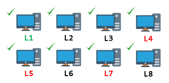
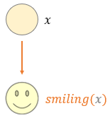
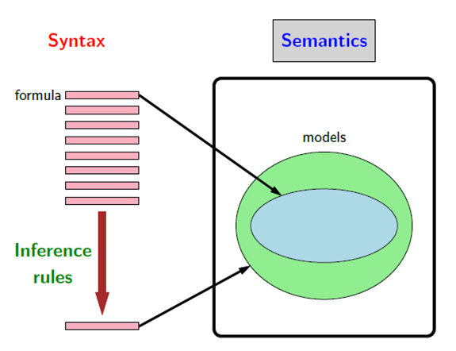
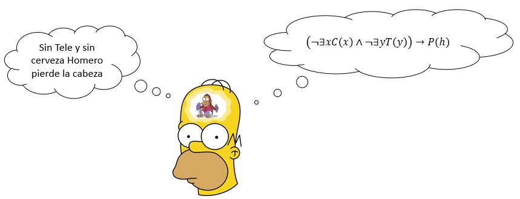

# 🐔 Expediente Gallinero — El Pollo Robot que rompió la lógica proposicional
### De proposiciones a predicados: Universo, Variables, Constantes, Predicados, Funciones Proposicionales, Cuantificadores, Conjunto de Verdad y Traducción Lenguaje Natural ↔ Formal

*Notas de clase — Matemáticas Discretas 1 · Módulo 2: Lógica Cuantificacional (Lógica de Predicados)*
*Universidad de Antioquia · Ingeniería de Sistemas*

---

## Cerrando el caso anterior

En la sesión pasada terminamos cazando un *bug* con reglas de inferencia, y dejamos una promesa escrita al final: hasta ese punto, todos nuestros argumentos hablaban de **proposiciones completas** ($p$: *"falló la caché"*, $q$: *"el sitio está en línea"*). Cada proposición era una caja cerrada: verdadera o falsa, y nada más.

Pero muchísimos razonamientos reales no son así. Hablan de *"todos"* y de *"algunos"*:

- *"**Todo** usuario autenticado tiene permisos."*
- *"**Existe** al menos un registro corrupto en la base de datos."*
- *"**Ningún** proceso zombi responde a la señal de apagado."*

Para frases como estas, la lógica proposicional se queda corta — y prometimos que ahí seguiríamos. Esta es esa sesión. Vamos a abrir las cajas cerradas: a mirar *de qué* o *de quién* habla cada proposición, y a poder decir cosas sobre **poblaciones enteras** de objetos, no solo sobre hechos sueltos.

Y para presentar esa idea, esta vez no arrancamos con un detective ni con una polilla, sino con un pollo. Un pollo muy particular.

---

## Contexto: el Pollo Robot

Imagine una granja de investigación donde un ingeniero construye y mantiene **pollos robot**: aves mecánicas, cada una con su número de serie, su sensor, su batería y su firmware. Algunos funcionan a la perfección; otros tienen un tornillo suelto, una batería agotada o un virus en el firmware. El ingeniero necesita razonar sobre su gallinero: *"¿**todos** los pollos robot están operativos?"*, *"¿**existe** alguno con el firmware infectado?"*, *"¿**cuáles** necesitan mantenimiento?"*.

Fíjese que ninguna de esas preguntas se puede responder tratando *"el gallinero funciona"* como una sola caja cerrada. Necesitamos hablar de **cada pollo**, de sus **propiedades**, y de **cuántos** de ellos cumplen cada condición. Ese es, exactamente, el salto que da esta clase — y el pollo robot será nuestro hilo conductor para aplicarlo.

> [!NOTE]
> **De dónde viene la idea.** El "pollo robot" está inspirado en la serie de animación *Robot Chicken* (Adult Swim), y en particular en el sketch **"Cut Down in His Optimus Prime"** del episodio *"Junk in the Trunk"* (temporada 1, episodio 1): [ver en YouTube](https://www.youtube.com/watch?v=j9kzZfb-UfI). Es contenido de humor para público adulto; aquí solo tomamos prestada la imagen del *pollo robot* como vehículo para aprender lógica de predicados — nada de la trama de la serie es necesario para estudiar este documento.

---

## Antes de comenzar — lo que ya debería saber

Esta sesión **abre un módulo nuevo**. No es la continuación técnica de un tema anterior, sino un salto conceptual: pasamos de la lógica proposicional a la lógica de predicados. Por eso los prerrequisitos son pocos y generales. Antes de continuar, verifique que puede:

- Reconocer qué es una **proposición**: un enunciado que es verdadero o falso, pero no ambos.
- Usar los **conectivos lógicos** $\neg$ (no), $\land$ (y), $\lor$ (o), $\rightarrow$ (si… entonces), $\leftrightarrow$ (si y solo si).
- Interpretar el valor de verdad de una expresión compuesta con esos conectivos.

Eso es todo lo que se necesita de las clases anteriores. Si algo de esto no le resulta claro, repáselo en las primeras sesiones del curso ([Clase 6](clase6.md) y previas) antes de continuar. Este documento no depende de conexión a internet para estudiarlo: todo lo necesario está aquí.

---

## El caso — un gallinero que la lógica proposicional no sabe describir

El ingeniero enciende su tablero de monitoreo y ve el estado de su gallinero. Quiere afirmar, con una sola frase, algo tan simple como:

> *"Todos los pollos robot del laboratorio están funcionando correctamente."*

Y a partir de esa frase quisiera poder deducir cosas concretas: si el pollo `P3` está funcionando, si el pollo `P7` tiene un virus, si hay **algún** pollo averiado. Pero con las herramientas de la lógica proposicional, esa frase es una única caja cerrada, una sola letra $p$ — y de una letra no se puede sacar información sobre `P3`, `P7`, ni sobre ninguno de los pollos individualmente.

La pregunta de esta sesión es: **¿qué tipo de lógica necesitamos para poder hablar, con precisión matemática, de todos los pollos, de algunos, y de cada uno por su nombre?** Al final del documento tendremos las herramientas para escribir esa frase de forma que sí podamos razonar con ella — y veremos también dónde esas herramientas todavía se quedan cortas, marcando el camino hacia lo que viene más adelante en el curso.

---

# Parte I — Por qué la Lógica Proposicional se queda corta

## I.1 Un ejemplo que lo deja todo en evidencia

Considere el laboratorio de sistemas con ocho computadores, etiquetados de `L1` a `L8`. El técnico afirma un solo hecho global:

> *"Todos los computadores del laboratorio están funcionando correctamente."*

En lógica proposicional, esa frase es una única proposición. Le ponemos una letra:

$$p:\ \text{«Todos los computadores del laboratorio están funcionando correctamente.»}$$

Ahora bien, con **base únicamente en esa proposición $p$**, el técnico quisiera concluir afirmaciones sobre computadores concretos:

- *"El computador `L1` está funcionando correctamente."*
- *"El computador `L4` tiene el sistema operativo dañado."*
- *"El computador `L5` tiene un virus."*
- *"El computador `L7` no tiene teclado."*

El problema es demoledor: **ninguna de estas conclusiones se puede deducir de $p$**. Y no porque sean falsas, sino porque la lógica proposicional *no tiene forma de conectarlas con $p$*. Para ella, cada una de esas cuatro frases es otra caja cerrada, otra letra distinta:

$$q:\ \text{«}L1\text{ funciona»},\quad r:\ \text{«}L4\text{ tiene el SO dañado»},\quad s:\ \text{«}L5\text{ tiene virus»},\quad t:\ \text{«}L7\text{ no tiene teclado».}$$

Entre $p$ y $q$ no hay ninguna relación lógica que la teoría pueda ver. La proposición $p$ ni siquiera "sabe" que `L1` es uno de los computadores de los que habla. Son cinco letras sueltas, sin puentes entre ellas.

## I.2 Las tres limitaciones, en concreto

El ejemplo anterior no es un accidente: expone tres carencias estructurales de la lógica proposicional. La siguiente tabla las resume.

| Limitación | En qué consiste |
|:---|:---|
| **No distingue el contenido interno de las proposiciones.** | Trata cada enunciado como un átomo indivisible. No puede razonar sobre los objetos individuales que aparecen dentro de la frase. Con lo que afirma $p$ no hay forma de saber que existe una contradicción entre *"todos funcionan"* y *"`L4` tiene el SO dañado"*, porque la teoría no sabe que `L4` es uno de los computadores de los que habla $p$. |
| **No expresa generalizaciones ni excepciones de forma general.** | No puede decir cosas como *"todos los computadores **excepto** `L4` funcionan"*, ni reglas del tipo *"**si** un computador tiene virus, **entonces** no funciona bien"* — al menos no de manera compacta y uniforme. En un universo finito y pequeño, sí podría enumerarse caso por caso con una letra proposicional distinta para cada computador (algo como $q_1 \land q_2 \land \neg q_4 \land \dots$), pero eso no escala: para cien computadores harían falta cien letras sueltas, y ninguna regla general que las conecte. |
| **No conecta internamente las ideas.** | Como no ve el interior de las frases, no puede establecer relaciones lógicas complejas entre ellas. No hay forma de responder preguntas como *"¿qué computadores pertenecen al laboratorio?"*, *"¿qué significa exactamente 'funcionar correctamente'?"* o *"¿un computador con virus funciona o no?"*. |

> [!IMPORTANT]
> **Conclusión.** La lógica proposicional es excelente para verdades **globales y simples** (*"llueve"*, *"el sitio está en línea"*). Pero si lo que queremos es modelar un sistema realista —con objetos específicos, propiedades individuales, reglas generales y excepciones— se nos queda corta. Necesitamos otro tipo de lógica: la **lógica de predicados**, también llamada **lógica cuantificacional** por el papel central de los cuantificadores $\forall$ y $\exists$. Ambos nombres se usan en este curso como sinónimos de lo que, en un contexto más formal, se conoce como **lógica de primer orden** (*FOL*, por *First-Order Logic*): lo que presentamos aquí es una introducción a la lógica de primer orden, con cuantificación sobre individuos del universo.

## I.3 La pista está en la gramática: sujeto y predicado

¿Por dónde empezar a "abrir la caja"? Por algo que usted ya conoce desde la escuela: la estructura de una oración. Muchas oraciones declarativas —las que afirman algo, que son las que nos interesan aquí— pueden analizarse, para efectos de esta introducción, separando dos partes:

- **Sujeto:** de quién o de qué se habla.
- **Predicado:** lo que se dice del sujeto.

Tome la frase del computador `L1`:

$$\underbrace{\text{El computador }L1}_{\textbf{Sujeto}}\ \underbrace{\text{está funcionando correctamente}}_{\textbf{Predicado}}$$

O esta otra, con un perro:

$$\underbrace{\text{El perro de Bart}}_{\textbf{Sujeto}}\ \underbrace{\text{se llama Ayudante de Santa}}_{\textbf{Predicado}}$$

## I.4 El salto: separar el sujeto del predicado

Aquí está la idea central de todo el módulo. En **lógica proposicional**, teniendo en cuenta que la unidad fundamental es la proposición, toda la frase *"El computador `L1` está funcionando correctamente"* se comprime en una sola letra $p$. Solo interesa si es verdadera o falsa; no interesa qué son "computador" ni "funcionando".

En **lógica de predicados** hacemos algo distinto: **separamos el sujeto del predicado y los modelamos por separado**.

- El **sujeto** se representa como un **objeto** o **individuo**: aquí, `L1`.
- El **predicado** se representa como una **propiedad** o **relación**: aquí, *"…está funcionando correctamente"*, que escribimos $funciona(x)$.

Al unir el predicado con el objeto concreto, obtenemos:

$$funciona(L1)$$

que se lee *"`L1` está funcionando correctamente"*. La diferencia con $p$ es abismal: ahora la expresión **contiene** al objeto `L1` explícitamente. Podemos hablar de $funciona(L2)$, $funciona(L7)$, o de $funciona(x)$ para un computador cualquiera $x$. Acabamos de abrir la caja.

> [!TIP]
> **Compruebe su comprensión.** En lógica proposicional, ¿cuántas letras distintas hacen falta para representar *"`L1` funciona"*, *"`L2` funciona"* y *"`L3` funciona"*? ¿Y en lógica de predicados, con el predicado $funciona(x)$?
>
> 

Ver respuesta

>
> En lógica proposicional hacen falta **tres letras distintas** ($p$, $q$, $r$), sin ninguna relación visible entre ellas. En lógica de predicados basta **un solo predicado** $funciona(x)$ aplicado a tres objetos: $funciona(L1)$, $funciona(L2)$, $funciona(L3)$. La estructura común ("…funciona") queda capturada una sola vez. Esa economía es justamente lo que nos permitirá, más adelante, decir "todos funcionan" de un solo golpe.
>
> 

---

# Parte II — Los Bloques de la Lógica de Predicados

Para trabajar con lógica de predicados necesitamos un vocabulario preciso. Esta parte define, uno por uno, los conceptos clave: universo, objeto, constante, variable, predicado, función proposicional y conjunto de verdad. Cada uno viene con su definición y un ejemplo neutro.

## II.1 Universo (dominio del discurso)

> [!IMPORTANT]
> El **universo** (también llamado **dominio del discurso**) es el conjunto de **todos los objetos** sobre los que estamos razonando dentro de una teoría lógica. En otras palabras, es el "mundo" que se está modelando.

Un punto crucial: **el universo lo define quien modela el problema**. No es algo fijo ni universal; depende del contexto. La misma pregunta puede tener respuestas distintas según el universo elegido. Vea cómo cambia:

| Contexto | Universo |
|:---|:---|
| Computadores del laboratorio | $\{L1, L2, L3, L4, L5, L6, L7, L8\}$ |
| Transformers | $\{Megatron, Optimus, \dots\}$ |
| Números reales | $(-\infty, +\infty)$ |
| Apóstoles | $\{Pedro, Juan, Santiago, \dots\}$ |
| Números enteros | $\{\dots, -2, -1, 0, 1, 2, \dots\}$ |

Elegir bien el universo es la primera decisión de todo modelado: fija de qué objetos se puede hablar y, con ello, qué afirmaciones tienen sentido.

> [!NOTE]
> **Un adelanto importante.** Cambiar el universo no solo cambia si una afirmación resulta verdadera o falsa (eso ya es bastante) — a veces cambia **la forma misma de la fórmula**: cuántos predicados hacen falta y si se necesita o no un conectivo. Un mismo enunciado en español puede traducirse con una fórmula más simple o más compleja según qué tan amplio se elija el universo. Lo vemos con un ejemplo completo, resuelto de las dos maneras, en el **Ejercicio 4** ("No todo lo que brilla es oro") más adelante — y se repite, con el propio pollo robot, entre el **Expediente Gallinero** y los **Ejercicios propuestos**.

## II.2 Objeto (individuo o elemento)

> [!IMPORTANT]
> Un **objeto** (también llamado **individuo** o **elemento**) es un **miembro concreto** del universo sobre el cual se está razonando.

Si el universo es el conjunto de computadores, un objeto es `L6`. Si es el de los Transformers, un objeto es `Optimus`. Si es el de los números reales, un objeto es $\pi$. Si es el de los apóstoles, un objeto es `Pedro`. Si es el de los enteros, un objeto es `4`.

| Contexto | Universo | Un objeto |
|:---|:---:|:---:|
| Computadores del laboratorio | $\{L1, \dots, L8\}$ | $L6$ |
| Transformers | $\{Megatron, Optimus, \dots\}$ | $Optimus$ |
| Números reales | $(-\infty, +\infty)$ | $\pi$ |
| Apóstoles | $\{Pedro, Juan, \dots\}$ | $Pedro$ |
| Números enteros | $\{\dots, -1, 0, 1, \dots\}$ | $4$ |

## II.3 Constante

> [!IMPORTANT]
> Una **constante** es un símbolo que **nombra a un objeto específico** del universo. Se refiere siempre al mismo individuo.

`L6`, `Optimus`, `Pedro` y `4` son constantes: cada una señala a un individuo fijo y determinado. La diferencia con una variable es que una constante **no cambia**: siempre apunta al mismo objeto del universo.

## II.4 Variable

> [!IMPORTANT]
> Una **variable** es un símbolo que representa a **cualquier objeto** (no específico) del universo. No tiene un valor fijo por sí sola: puede tomar cualquier valor del dominio.

La distinción entre constante y variable es la misma que en programación:

- $x$ es una **variable**: no sabemos quién es, puede cambiar. Escribimos $persona(x)$: *"x es una persona"*.
- $homero$ es una **constante**: se refiere a un individuo específico del universo. Escribimos $persona(homero)$: *"Homero es una persona"*.

En símbolos, decir que la variable $x$ toma valores en el universo $U$ se escribe $x \in U$, o de forma más explícita $\{\ x \mid x \in U\ \}$, que se lee *"los x tales que x pertenece a U"*.

## II.5 Predicado

> [!IMPORTANT]
> Un **predicado** es una **función lógica** que expresa una **propiedad** de un objeto o una **relación** entre objetos dentro del universo. Permite describir *qué es cierto* respecto a los elementos del universo.

Los predicados se clasifican por cuántos objetos relacionan (su **aridad**):

| Tipo | Notación | Significado | Ejemplo |
|:---|:---:|:---|:---|
| **Unitario** | $P(x)$ | Propiedad de **un** objeto | $enfermo(x)$: *"x está averiado"* |
| **Binario** | $Q(x, y)$ | Relación entre **dos** objetos | $medico(x, y)$: *"x es el técnico de y"* |
| **Ternario** | $R(x, y, z)$ | Relación entre **tres** objetos | $dijo(x, y, z)$: *"x le dijo a y que z"* |

Veámoslos con los Transformers, tal como aparecen en las diapositivas del curso.

**Predicado unitario.** *"Optimus Prime está averiado"* se modela con el predicado unitario $enfermo(x)$ aplicado al objeto $optimus$:

$$enfermo(optimus)$$

**Predicado binario.** *"Ratchet es el técnico de Optimus"* relaciona **dos** objetos, así que usamos un predicado binario $medico(x, y)$:

$$medico(ratchet, optimus)$$

**Predicado ternario.** *"Ratchet le dijo a Optimus que está averiado"* relaciona **tres** cosas: quién habla ($ratchet$), a quién ($optimus$) y qué ($enfermo(optimus)$). Usamos un predicado ternario:

$$dijo(ratchet,\ optimus,\ enfermo(optimus))$$

> [!NOTE]
> **Una precisión honesta.** En lógica de primer orden **estricta**, el tercer argumento de $dijo$ debería ser un objeto, no una fórmula como $enfermo(optimus)$ (que es una proposición). Aquí lo usamos de forma **informal** para ilustrar la idea de un predicado ternario de manera intuitiva. Más adelante en su formación verá cómo se maneja esto con todo el rigor; por ahora, quédese con la idea de que un predicado puede relacionar tres objetos.

## II.6 Función proposicional

> [!IMPORTANT]
> Una **función proposicional** es una expresión lógica que **contiene variables libres** ($x$, $y$, …) y que **todavía no es una proposición completa** —es decir, todavía no tiene un valor de verdad definido—.

Una función proposicional se convierte en **proposición** (con valor de verdad V o F) de dos maneras:

1. **Asignándole valores** a sus variables (reemplazando la variable por un objeto concreto).
2. **Cuantificando todas sus variables libres** (lo veremos en la Parte III).

En el segundo camino hay un matiz importante: el cuantificador debe ligar **todas** las variables que quedan libres, no solo alguna. Por ejemplo, con el predicado binario $R(x, y)$, la expresión $\forall x\ R(x, y)$ **todavía no es una proposición**: $x$ quedó ligada por el cuantificador, pero $y$ sigue libre. Solo al ligar también $y$ —con otro cuantificador, o asignándole un valor— se obtiene una proposición completa.

Veamos el primer camino con dos ejemplos. En ambos, el universo $U$ son los números enteros.

**Ejemplo con una variable.** Sea $P(x):\ x$ *es mayor que 5*.

| Expresión | ¿Qué es? |
|:---:|:---|
| $P(x)$ | Función proposicional (1 variable) — sin valor de verdad |
| $P(7)$ | Proposición **verdadera** ($7 > 5$) |
| $P(3)$ | Proposición **falsa** ($3 \not> 5$) |
| $\forall x\ P(x)$ | Proposición general (con cuantificador) |

**Ejemplo con tres variables.** Sea $R(x, y, z):\ x + y = z$.

| Expresión | ¿Qué es? |
|:---:|:---|
| $R(x, y, z)$ | Función proposicional (3 variables) |
| $R(2, -1, 5)$ | Proposición **falsa** ($2 + (-1) = 1 \neq 5$) |
| $R(3, 4, 7)$ | Proposición **verdadera** ($3 + 4 = 7$) |
| $R(x, 3, z)$ | Función proposicional (2 variables libres: $x$ y $z$) |

Note el último caso: si fijamos **algunas** variables pero dejamos otras libres, seguimos teniendo una función proposicional (con menos variables), no todavía una proposición.

**Variable libre vs. variable ligada.** Una variable está **ligada** cuando un cuantificador la alcanza; está **libre** si ningún cuantificador la menciona. Solo cuando **todas** las variables de la expresión quedan ligadas (o instanciadas) se obtiene una proposición:

| Expresión | Variables libres | Variables ligadas | ¿Qué es? |
|:---:|:---:|:---:|:---|
| $P(x)$ | $x$ | — | Función proposicional |
| $P(a)$ (con $a$ una constante) | — | — | Proposición |
| $\forall x\ P(x)$ | — | $x$ | Proposición |
| $R(x, y)$ | $x$, $y$ | — | Función proposicional |
| $\forall x\ R(x, y)$ | $y$ | $x$ | **Sigue siendo función proposicional** — $y$ no fue alcanzada por ningún cuantificador |
| $\forall x\ R(x, 3)$ | — | $x$ | Proposición — $x$ quedó ligada por el cuantificador y $y$ fue reemplazada por el valor $3$ |

> [!NOTE]
> **Predicado y función proposicional: ¿son lo mismo?** En cursos introductorios, muchos textos usan ambos términos casi como sinónimos, y para efectos prácticos de esta clase puede tratarlos así. La distinción fina es: el **predicado** es la propiedad o relación en sí ($funciona$, $enfermo$), y la **función proposicional** es la expresión que se obtiene al aplicarlo a variables ($funciona(x)$). Formalmente, **predicado** es el término más usado en lógica de primer orden.

## II.7 Conjunto de verdad

> [!IMPORTANT]
> El **conjunto de verdad** de un predicado $P(x)$ es el **subconjunto del dominio** $D$ formado por **todos los elementos para los cuales el predicado es verdadero**. Se escribe:
> $$\{\ x \in D \mid P(x)\text{ es verdadero}\ \}$$

Es la forma de responder *"¿para cuáles objetos se cumple esta propiedad?"*. Un ejemplo con los Transformers: sea $D$ el dominio de todos los Transformers (Autobots y Decepticons) y el predicado $autobot(x):\ x$ *es un autobot*. El conjunto de verdad es:

$$\{\ x \in D \mid autobot(x)\ \}$$

es decir, el subconjunto de los Transformers que son autobots. Evaluando el predicado en dos objetos concretos:

$$autobot(optimus) = \textbf{Verdadero} \qquad autobot(megatron) = \textbf{Falso}$$

Así, $optimus$ **pertenece** al conjunto de verdad y $megatron$ **no**.

> [!TIP]
> **Compruebe su comprensión.** Sea el universo $U=\{L1,\dots,L8\}$ (los computadores del laboratorio) y el predicado $tieneVirus(x)$. Suponga que solo `L5` y `L7` están infectados. ¿Cuál es el conjunto de verdad de $tieneVirus(x)$?
>
> 

Ver respuesta

>
> El conjunto de verdad es $\{\ x \in U \mid tieneVirus(x)\ \} = \{L5, L7\}$: exactamente los objetos del universo para los cuales el predicado es verdadero. Todos los demás computadores quedan fuera de ese conjunto.
>
> 

---

# Parte III — Cuantificadores

Ya sabemos hablar de objetos individuales. Ahora viene la herramienta que da nombre a toda esta rama —la lógica *cuantificacional*— y que resuelve el problema con el que abrimos la clase: poder decir *"todos"* y *"algunos"*.

## III.1 Qué es un cuantificador

> [!IMPORTANT]
> Los **cuantificadores** son símbolos lógicos que indican **cuántos elementos** del dominio cumplen una determinada propiedad (expresada por un predicado o función proposicional). Existen dos:
> - **Cuantificador universal** $\forall x$: se lee *"para todo x"*.
> - **Cuantificador existencial** $\exists x$: se lee *"existe al menos un x"*.

La idea es visual. Partimos de un objeto genérico $x$ y de un predicado, por ejemplo $smiling(x)$: *"x está sonriendo"*.

Ahora aplicamos cada cuantificador sobre una población de caritas:

**Cuantificador existencial — $\exists x\ smiling(x)$** (*"existe al menos una carita que sonríe"*): basta con que **una** cumpla. En la siguiente población, algunas sonríen y otras no — y como **hay al menos una** sonriendo, la proposición es **verdadera**.

**Cuantificador universal — $\forall x\ smiling(x)$** (*"todas las caritas sonríen"*): se exige que **todas** cumplan. En esta otra población, **todas** sonríen, así que la proposición es **verdadera**. (Si una sola no sonriera, sería falsa.)

## III.2 El cuantificador convierte una función proposicional en proposición

Este es el punto clave que conecta con la Parte II. Recuerde que $smiling(x)$, por sí sola, es una **función proposicional**: no es verdadera ni falsa hasta que sepamos quién es $x$. Pero al anteponerle un cuantificador, la expresión pasa a hablar de **toda la población de una vez**, y entonces **sí** tiene un valor de verdad definido:

$$\underbrace{smiling(x)}_{\text{función proposicional (sin V/F)}} \qquad\longrightarrow\qquad \underbrace{\forall x\ smiling(x)}_{\text{proposición (V o F)}}$$

Volviendo al ejemplo con el que abrimos la Parte I: *"Todos los computadores del laboratorio están funcionando correctamente"* ya no es una caja cerrada. Ahora la podemos escribir así:

$$\forall x\ \bigl(computadorLIS(x) \rightarrow funciona(x)\bigr)$$

que se lee *"para todo x, si x es un computador del laboratorio, entonces x funciona"*. Y de una afirmación así **sí** podemos deducir, por ejemplo, que si `L1` es un computador del laboratorio, entonces `L1` funciona. Exactamente lo que la lógica proposicional no podía hacer.

> [!NOTE]
> **Precisando el universo.** Aquí el universo $U$ se toma **amplio** —computadores en general, no solo los ocho del laboratorio ($L1,\dots,L8$) con los que abrimos la Parte I—, por eso $computadorLIS(x)$ aporta información real y hace falta el conectivo $\rightarrow$. Si en cambio el universo fuera *solo* esos ocho computadores, $computadorLIS(x)$ sería verdadero para todo el universo (redundante), y la fórmula se simplificaría a $\forall x\ funciona(x)$ — el mismo fenómeno que va a ver, con el pollo robot, entre el Expediente Gallinero y los Ejercicios propuestos.

> [!WARNING]
> **El error más común al cuantificar: emparejar mal el cuantificador y el conectivo.** Hay una regla práctica que evita la mayoría de los errores de traducción:
> - El cuantificador **universal** $\forall$ se empareja casi siempre con la **implicación** $\rightarrow$.
> - El cuantificador **existencial** $\exists$ se empareja casi siempre con la **conjunción** $\land$.
>
> Es decir, se escribe $\forall x\ (S(x) \rightarrow P(x))$ y $\exists x\ (S(x) \land P(x))$. Escribir $\exists x\ (S(x) \rightarrow P(x))$ es casi siempre un error: por la tabla de verdad de $\rightarrow$, esa expresión se vuelve verdadera de forma "tramposa" apenas exista **un solo** objeto que **no** cumpla $S(x)$ (porque entonces el antecedente es falso y la implicación, verdadera), sin importar nada sobre $P$. En la Parte V veremos esto con las formas aristotélicas.

## III.3 Negar un cuantificador

> [!IMPORTANT]
> Negar una afirmación cuantificada **cambia el cuantificador**:
> - $\neg\ \forall x\ P(x) \equiv \exists x\ \neg P(x)$ — *"no todos cumplen P"* equivale a *"existe al menos uno que no cumple P"*.
> - $\neg\ \exists x\ P(x) \equiv \forall x\ \neg P(x)$ — *"no existe ninguno que cumpla P"* equivale a *"todos incumplen P"*.

La intuición: decir *"no todos los pollos robot funcionan"* no significa que ninguno funcione — significa que **al menos uno** falla. Y decir *"no existe ningún pollo con virus"* sí significa que **todos** están limpios. En ambos casos, la negación "empuja" hacia adentro del cuantificador y lo invierte: $\forall$ se convierte en $\exists$ (o viceversa), y el predicado queda negado.

> [!TIP]
> **Compruebe su comprensión.** ¿Cuál es la negación de $\forall x\ tieneVirus(x)$ (*"todos los pollos tienen virus"*), simplificada hasta dejarla como un existencial? ¿Qué dice en lenguaje natural?
>
> 

Ver respuesta

>
> $\neg\ \forall x\ tieneVirus(x) \equiv \exists x\ \neg tieneVirus(x)$: *"existe al menos un pollo robot que no tiene virus"*. Note que negar *"todos"* no da *"ninguno"* — da *"no todos"*, que es más débil.
>
> 

---

# Parte IV — Expresiones Compuestas y Verificación de Tipos

## IV.1 Combinar predicados con conectivos

Los predicados y cuantificadores no viven aislados: se combinan entre sí usando los **conectivos lógicos** que ya conoce ($\neg$, $\land$, $\lor$, $\rightarrow$, $\leftrightarrow$) para formar **expresiones compuestas**. Estas permiten construir afirmaciones complejas sobre múltiples objetos, relaciones y condiciones dentro de un mismo razonamiento.

Un ejemplo. Suponga los predicados:

- $P(x):$ *"x es un profesor"*
- $Q(x):$ *"x es un ingeniero"*

La expresión compuesta *"x es un profesor **y** x es un ingeniero"* se escribe:

$$P(x) \land Q(x)$$

Mientras tenga la variable libre $x$, esto sigue siendo una **función proposicional** (sin valor de verdad). Pero si reemplazamos $x$ por un objeto específico —digamos **CPS** (Charles Proteus Steinmetz, ingeniero eléctrico e instructor histórico)— se convierte en una **proposición**:

$$P(\text{CPS}) \land Q(\text{CPS})$$

que afirma *"CPS es profesor y CPS es ingeniero"*, y ahora sí es verdadera o falsa.

## IV.2 Tabla de verificación de tipos

Cuando las expresiones se complican, es fácil combinar mal las piezas. Una herramienta simple y poderosa para evitarlo es la **tabla de verificación de tipos**: describe, para cada componente lógico, **sobre qué opera** (su entrada) y **qué produce** (su salida).

| Elemento | Opera sobre… | Produce…* | Ejemplo |
|:---|:---|:---|:---|
| **Conectivos** ($\neg, \land, \lor, \rightarrow, \leftrightarrow$) | Proposiciones | Una proposición | $P \land Q,\ \neg P,\ P \rightarrow Q$ |
| **Predicados** ($=, <, \dots$) | Objetos | Una proposición | $mayorQue(x, y),\ x = y,\ par(x)$ |
| **Funciones** | Objetos | Un **objeto** | $doble(x),\ padreDe(x),\ suma(x, y)$ |

*\*Estrictamente, esto vale cuando ya no quedan variables libres. Si algún argumento sigue siendo una variable sin asignar ni cuantificar —como en $mayorQue(x, y)$ o en $P(x) \land Q(x)$—, el resultado sigue siendo una **función proposicional** (Parte II.6), no todavía una proposición. La tabla muestra el caso ya instanciado, que es el más simple para fijar la distinción entre predicado y función matemática.*

La distinción más útil de esta tabla es la última fila: una **función** (en el sentido matemático, como $doble(x)$ o $suma(x,y)$) toma objetos y **devuelve otro objeto** —un número, una persona—, mientras que un **predicado** toma objetos y devuelve un **valor de verdad** (una vez resueltas sus variables). Confundir ambos es una fuente típica de errores: $par(x)$ es verdadero o falso una vez asignado o cuantificado $x$ (predicado), pero $doble(x)$ es siempre un número (función).

> [!NOTE]
> **Un vistazo adelante: el "modelo" (opcional).** En lógica, un **modelo** es una interpretación que asigna significado a los símbolos de un lenguaje lógico y que hace que un conjunto de fórmulas sea verdadero. Es contenido de profundización, no indispensable para seguir esta clase.
>
> 

Ver la idea completa

>
> 
>
> Un modelo es una representación de la realidad construida a partir de ciertos elementos y reglas. En **lógica proposicional**, un modelo simplemente mapea cada símbolo proposicional a un valor de verdad (una fila de la tabla de verdad). En **lógica cuantificacional**, un modelo es más rico: define un universo de objetos y asigna un significado a cada constante, predicado y función. La construcción formal completa de un modelo en lógica de predicados es tema de sesiones posteriores; por ahora basta con la intuición de que *elegir el universo y el significado de los predicados es, precisamente, construir el modelo*.
>
> 

---

# Parte V — Traducción: Lenguaje Natural ↔ Lenguaje Formal

Una de las habilidades centrales de esta rama —y una de las más útiles para un ingeniero— es **traducir** entre el lenguaje natural (cómo hablamos) y el lenguaje formal (cómo escribe la lógica). Es importante en dos direcciones: para dar sentido preciso a conceptos matemáticos nuevos, y para analizar con rigor un problema complicado (por ejemplo, leer un requisito de software y capturar exactamente lo que pide, sin ambigüedad).

Un ejemplo de traducción de lenguaje natural a formal, con Homero: *"Sin tele y sin cerveza, Homero pierde la cabeza"*. Con los predicados $C(x)$: *"x es cerveza"*, $T(y)$: *"y es tele"*, $P(z)$: *"z pierde la cabeza"*, y la constante $h$ (Homero), la frase se formaliza como:

$$\bigl(\neg\exists x\ C(x) \land \neg\exists y\ T(y)\bigr) \rightarrow P(h)$$

*"Si no existe cerveza y no existe tele, entonces Homero pierde la cabeza"*.

## V.1 Un proceso en seis pasos

Para traducir enunciados del lenguaje natural a lógica de predicados, conviene seguir un método ordenado:

1. **Identificar** las proposiciones simples o propiedades involucradas.
2. **Definir** las funciones proposicionales y constantes — el "diccionario" del problema.
3. **Determinar** el dominio del discurso: ¿sobre qué universo estamos hablando?
4. **Identificar la estructura** de la oración: ¿es universal, existencial, negada, condicional?
5. **Aplicar la forma aristotélica** correspondiente, si aplica (ver abajo).
6. **Escribir** la expresión en lógica de predicados y **verificar** que captura el significado original.

## V.2 Las cuatro formas aristotélicas

Las **cuatro formas aristotélicas** (llamadas A, E, I, O desde la lógica medieval) son plantillas de traducción muy útiles: cubren los cuatro patrones más comunes de cuantificación. Son una guía, no una camisa de fuerza — el lenguaje natural puede ser más complejo y requerir combinarlas —, pero dominar estas cuatro resuelve la mayoría de los casos.

| Forma | Nombre | Enunciado típico | Traducción en lógica de predicados | Emparejamiento clave |
|:---:|:---|:---|:---:|:---|
| **A** | Universal afirmativa | *"Todo S es P"* | $\forall x\ (S(x) \rightarrow P(x))$ | $\forall$ con $\rightarrow$ |
| **E** | Universal negativa | *"Ningún S es P"* | $\forall x\ (S(x) \rightarrow \neg P(x))$ | $\forall$ con $\rightarrow$ y $\neg$ |
| **I** | Particular afirmativa | *"Algún S es P"* | $\exists x\ (S(x) \land P(x))$ | $\exists$ con $\land$ |
| **O** | Particular negativa | *"Algún S no es P"* | $\exists x\ (S(x) \land \neg P(x))$ | $\exists$ con $\land$ y $\neg$ |

Observe el patrón que anticipamos en la Parte III: las dos formas **universales** (A, E) usan $\forall$ con $\rightarrow$; las dos **particulares** (I, O) usan $\exists$ con $\land$.

> [!WARNING]
> **Error común en la forma I.** Para *"Algún S es P"* se tiende a escribir, por error, $\exists x\ (S(x) \rightarrow P(x))$ en lugar de $\exists x\ (S(x) \land P(x))$. Con la implicación $\rightarrow$, la expresión se vuelve **verdadera de forma trivial** en cuanto exista un solo objeto $x$ para el cual $S(x)$ sea **falso** (antecedente falso $\Rightarrow$ implicación verdadera), lo que **no** captura el significado de *"algún S es P"*. La forma correcta con $\exists$ es siempre con $\land$: exige que **exista** un objeto que sea $S$ **y además** sea $P$.

---

# 📘 Ejercicios resueltos — Traducción y modelado

Estos ejercicios son los que se resolvieron en clase. Cada uno se desarrolla paso a paso, explicando *por qué* se hace cada movimiento, no solo el resultado. El objetivo es que pueda reproducir el razonamiento por su cuenta.

## Ejercicio 1 — ¿Cuáles frases dicen lo mismo?

Considere el enunciado:

> *"Para todo jugador de baloncesto x, x es alto."*

¿Cuáles de las siguientes formas de expresión son **equivalentes** a este enunciado?

- **(a)** Todo jugador de baloncesto es alto.
- **(b)** Entre todos los jugadores de baloncesto, algunos son altos.
- **(c)** Algunas de las personas altas son jugadores de baloncesto.
- **(d)** Cualquier persona alta es un jugador de baloncesto.
- **(e)** Todas las personas que son jugadores de baloncesto son altas.
- **(f)** Cualquier persona que es un jugador de baloncesto es una persona alta.

**Paso 1 — Formalizar el enunciado base.** Definimos el diccionario: $B(x)$: *"x es jugador de baloncesto"*, $A(x)$: *"x es alto"*. El enunciado *"para todo jugador de baloncesto x, x es alto"* tiene la estructura de una **forma A** (universal afirmativa: *"todo B es A"*):

$$\forall x\ \bigl(B(x) \rightarrow A(x)\bigr)$$

**Paso 2 — Comparar cada opción con esa estructura.** Una frase es equivalente si, y solo si, tiene la misma forma lógica. Revisemos:

- **(a), (e), (f)** son tres maneras distintas de decir *"todo jugador de baloncesto es alto"* — todas se formalizan como $\forall x\ (B(x) \rightarrow A(x))$. **Son equivalentes.** ✔
- **(b)** dice *"algunos jugadores son altos"*: eso es $\exists x\ (B(x) \land A(x))$ (forma I). Afirma menos que el original (el original dice *todos*, no *algunos*). **No equivalente.**
- **(c)** dice *"algunas personas altas son jugadores"*: $\exists x\ (A(x) \land B(x))$. También es un existencial, no un universal. **No equivalente.**
- **(d)** dice *"cualquier persona alta es jugador"*: $\forall x\ (A(x) \rightarrow B(x))$. ¡Ojo! Esto **invierte la flecha**: afirma que ser alto implica ser jugador, que es lo contrario de lo que dice el original. **No equivalente.**

**Respuesta.** Las formas equivalentes son **(a), (e) y (f)**.

> [!TIP]
> **Antes de continuar, pregúntese:** ¿por qué (d) no es equivalente, si "usa las mismas palabras"? La diferencia está en la **dirección de la implicación**: $B(x)\rightarrow A(x)$ ("si es jugador, es alto") no es lo mismo que $A(x)\rightarrow B(x)$ ("si es alto, es jugador"). Confundir una implicación con su recíproca es uno de los errores más frecuentes al traducir — y aquí lo ve en acción.

## Ejercicio 2 — Del lenguaje formal al natural

Traduzca las siguientes expresiones a lenguaje natural, donde $C(x)$: *"x es un comediante"* y $F(x)$: *"x es gracioso"*, y el dominio son todas las personas.

**(a)** $\forall x\ (C(x) \rightarrow F(x))$
**(b)** $\forall x\ (C(x) \land F(x))$
**(c)** $\exists x\ (C(x) \rightarrow F(x))$
**(d)** $\exists x\ (C(x) \land F(x))$

**Paso 1 — Leer el cuantificador y el conectivo juntos.** La clave es interpretar el emparejamiento cuantificador–conectivo con cuidado, sobre todo distinguir las formas "sanas" (A e I) de las que producen lecturas raras.

**(a)** $\forall x\ (C(x) \rightarrow F(x))$ — forma A. Se lee: ***"Todo comediante es gracioso"*** (para toda persona, si es comediante entonces es graciosa).

**(b)** $\forall x\ (C(x) \land F(x))$ — universal con conjunción. Se lee: ***"Todas las personas son comediantes y graciosas"***. Note lo fuerte (y absurdo) de la afirmación: no dice algo sobre los comediantes, sino que **toda persona del universo** es a la vez comediante y graciosa.

**(c)** $\exists x\ (C(x) \rightarrow F(x))$ — existencial con implicación. Se lee literalmente: *"Existe una persona tal que, si es comediante, entonces es graciosa"*. Es una afirmación **lógicamente débil**: basta que exista una sola persona que **no** sea comediante para que sea verdadera (antecedente falso). Por eso, como vimos en la advertencia de la Parte V, esta forma casi nunca captura lo que uno quiere decir.

**(d)** $\exists x\ (C(x) \land F(x))$ — forma I. Se lee: ***"Existe (hay) al menos un comediante que es gracioso"***.

**Paso 2 — Contrastar (c) y (d).** Este par ilustra perfectamente la advertencia de la Parte V: para expresar *"hay un comediante gracioso"*, la forma correcta es **(d)** con $\land$, no **(c)** con $\rightarrow$. La (c), aunque sintácticamente válida, dice algo mucho más débil y engañoso.

## Ejercicio 3 — Un objeto con dos propiedades (Einstein)

Formalice: *"Albert Einstein era un físico alemán."*

**Paso 1 — Determinar el universo y el diccionario.** Universo: las personas. Diccionario: $P(x)$: *"x es físico"*, $A(x)$: *"x es alemán"*. La frase atribuye **dos propiedades** al **mismo** individuo.

**Paso 2 — Escribir la función proposicional.** *"x es físico y x es alemán"* es una expresión compuesta:

$$P(x) \land A(x)$$

**Paso 3 — Instanciar en el objeto concreto.** Como el sujeto es un individuo específico, reemplazamos la variable por la constante $einstein$, y la función proposicional se convierte en una **proposición**:

$$P(einstein) \land A(einstein)$$

que afirma *"Einstein es físico y Einstein es alemán"*. Este ejercicio muestra el segundo camino de la Parte II.6: una función proposicional se vuelve proposición al **asignar un valor** a su variable.

## Ejercicio 4 — La importancia del universo ("No todo lo que brilla es oro")

Formalice el refrán: *"No todo lo que brilla es oro."*

Este ejercicio enseña una lección profunda: **la formalización correcta depende del universo que uno elija**. Lo resolvemos de dos maneras, ambas correctas.

**Interpretación 1 — Universo restringido: $U = \{\text{cosas que brillan}\}$.**

**Paso 1 — Fijar el universo y el diccionario.** Si decidimos que el universo son *solo las cosas que brillan* (una estrella, una lámpara…), entonces "brillar" ya está incorporado en el universo y no necesita predicado. Solo necesitamos $oro(x)$: *"x es oro"*.

**Paso 2 — Traducir.** *"No todo (lo que brilla) es oro"* dice que no es cierto que todos los objetos del universo sean oro:

$$\neg\ \forall x\ oro(x)$$

Por la regla de negación de cuantificadores, esto equivale a $\exists x\ \neg oro(x)$: *"existe algo (que brilla) que no es oro"*.

**Interpretación 2 — Universo amplio: $U = \{\text{todas las cosas}\}$.**

**Paso 1 — Fijar el universo y el diccionario.** Si el universo son *todas las cosas* (estrellas, lámparas, pero también personas, piedras…), entonces "brillar" ya **no** está garantizado, y necesitamos un predicado explícito: $brilla(x)$: *"x brilla"*, además de $oro(x)$.

**Paso 2 — Traducir.** Ahora la frase afirma que no es cierto que *todo lo que brilla* sea oro:

$$\neg\ \forall x\ \bigl(brilla(x) \rightarrow oro(x)\bigr)$$

que equivale a $\exists x\ \bigl(brilla(x) \land \neg oro(x)\bigr)$: *"existe algo que brilla y no es oro"*.

**Paso 3 — La moraleja.** Las dos formalizaciones son correctas y dicen lo mismo *en el mundo real*, pero **se escriben distinto porque el universo es distinto**. En la primera, "brillar" es una condición de pertenencia al universo; en la segunda, es un predicado que hay que verificar. **Antes de traducir, siempre pregúntese: ¿cuál es mi universo?** Esa decisión determina toda la fórmula.

Guarde esta lección: la va a ver otra vez, con el pollo robot, unas páginas más adelante — entre el **Expediente Gallinero** y los **Ejercicios propuestos** el enunciado *"todos los pollos robot funcionan"* se formaliza dos veces, con dos universos distintos, y da dos fórmulas de distinta forma. Es exactamente este mismo fenómeno.

Este es también un buen momento para volver a la **tabla de verificación de tipos** (Parte IV.2) y confirmar que todo encaja: $brilla$ y $oro$ son **predicados** (operan sobre objetos, producen valores de verdad); $\neg$, $\rightarrow$, $\land$ son **conectivos** (operan sobre proposiciones, producen proposiciones); $\forall$ y $\exists$ son **cuantificadores** (convierten funciones proposicionales en proposiciones). Los tipos calzan.

## Problema guiado — Complete el último paso

Formalice: *"Hay alguien mayor de 21 años"*, con universo *"las personas"* y predicado $mayor21(x)$: *"x es mayor de 21 años"*.

**Paso 1 — Identificar la estructura.** La palabra *"hay alguien"* señala una afirmación **existencial**: no se habla de todos, sino de que **existe al menos uno**. El cuantificador es $\exists$.

**Paso 2 — Elegir el conectivo (o la ausencia de él).** Como hay un solo predicado ($mayor21$) y ninguna condición adicional que restrinja el sujeto, no necesitamos combinar con $\land$ ni $\rightarrow$: basta aplicar el predicado directamente. **Complete usted la fórmula final:**

$$\exists x\ \bigl(\ \rule{6em}{0.06em}\ \bigr)$$

> [!TIP]
> 

Ver la respuesta del último paso

>
> La fórmula completa es:
> $$\exists x\ \bigl(mayor21(x)\bigr)$$
> que se lee *"existe al menos una persona x tal que x es mayor de 21 años"*. Aquí no hace falta ningún conectivo porque el universo (*"las personas"*) ya delimita el sujeto y solo se afirma una propiedad. Compare con *"algún estudiante es mayor de 21"*, que **sí** requeriría $\exists x\ (estudiante(x) \land mayor21(x))$ — forma I, con $\land$— porque ahí *"estudiante"* es una restricción adicional dentro de un universo más amplio.
>
> 

---

# 🐔 Expediente Gallinero — El ingeniero pone orden en el laboratorio

*Este bloque aplica —no explica— los conceptos ya vistos. Toda la teoría quedó atrás; aquí solo se usa.*

Volvamos al gallinero con el que abrimos la clase. El ingeniero ya no está atado a la lógica proposicional: ahora tiene predicados y cuantificadores. Definamos su modelo formal.

**El universo:** $U = \{P1, P2, P3, P4, P5, P6, P7, P8\}$, los ocho pollos robot del laboratorio.

**El diccionario de predicados:**

> [!NOTE]
> **Sobre el universo y el predicado $robot$.** Como el universo $U=\{P1,\dots,P8\}$ ya está restringido de entrada a *"los ocho pollos robot del laboratorio"*, un predicado $robot(x)$ que dijera *"x es un pollo robot"* sería verdadero para **todo** el universo — es decir, redundante: no aportaría información. Por eso el diccionario de este Expediente no lo incluye; las fórmulas hablan directamente de $x$ como pollo robot, sin necesidad de decirlo dos veces.
>
> Este es el mismo principio del **Ejercicio 4** ("brilla y oro"): el universo elegido determina la forma de la fórmula. Aquí, al cerrar el universo a solo pollos robot, la fórmula se simplifica. Más adelante, en los **Ejercicios propuestos**, el universo del laboratorio se amplía para incluir también otros dispositivos — y ahí sí hace falta recuperar $robot(x)$ y el conectivo $\rightarrow$, porque ya no todo el universo es un pollo robot.

| Predicado | Significado |
|:---|:---|
| $funciona(x)$ | *"x está operativo (sin avería)"* |
| $tieneVirus(x)$ | *"x tiene el firmware infectado"* |
| $tecnico(x, y)$ | *"x es el técnico responsable de y"* |

Ahora el ingeniero puede escribir, por fin, la frase con la que soñaba al inicio — la que la lógica proposicional no sabía representar:

$$\forall x\ funciona(x)$$

*"Para todo x (del gallinero), x funciona"* — es decir, *"todos los pollos robot funcionan"*. Y a diferencia de la caja cerrada $p$ del inicio, de esta afirmación **sí** puede deducir información sobre cada pollo: si $\forall x\ funciona(x)$ es verdadera, entonces en particular $funciona(P3)$ también lo es.

Con el mismo vocabulario, el ingeniero formaliza el resto de su tablero de monitoreo:

- *"Existe al menos un pollo robot con el firmware infectado"* — como el universo ya son solo pollos robot y no hay ninguna condición adicional que restrinja el sujeto, basta el predicado directo, sin conectivo (el mismo caso del Problema guiado más adelante):
$$\exists x\ tieneVirus(x)$$

- *"Ningún pollo robot con virus está operativo"* (forma E, con $\rightarrow$ y $\neg$):
$$\forall x\ \bigl(tieneVirus(x) \rightarrow \neg funciona(x)\bigr)$$

- *"Ratchet es el técnico del pollo P3"* (predicado binario, con una constante):
$$tecnico(ratchet, P3)$$

Cuatro afirmaciones que la lógica proposicional no podía ni empezar a escribir, ahora expresadas con precisión. El ingeniero cierra su tablero satisfecho… pero hay una pregunta que todavía no puede formular. La retomaremos en el veredicto.

---

## Ejercicios propuestos

Resuelva los siguientes ejercicios. Las respuestas finales están en el **Solucionario** al final del documento; intente cada uno antes de mirarlas.

**Definiciones para varios ejercicios.** Universo: el laboratorio de robótica, que incluye los ocho pollos robot ($P1,\dots,P8$) junto con otros dispositivos de monitoreo (cámaras, sensores fijos, estaciones de carga) que **no** son pollos robot. Predicados: $robot(x)$ (*"x es un pollo robot"*), $funciona(x)$, $tieneVirus(x)$, $vuela(x)$ (*"x puede volar"*).

> [!NOTE]
> **Por qué aquí sí necesitamos $robot(x)$.** En el Expediente Gallinero, el universo era *solo* los ocho pollos robot, así que $robot(x)$ sobraba y las fórmulas quedaron más simples (por ejemplo, $\forall x\ funciona(x)$). Aquí el universo es más amplio —incluye dispositivos que no son pollos robot—, así que $robot(x)$ vuelve a aportar información real, y las fórmulas de los ejercicios siguientes sí necesitan la estructura completa $robot(x) \rightarrow \dots$ o $robot(x) \land \dots$. Es el mismo enunciado tipo *"todos los pollos robot funcionan"* que en el Expediente, pero con universo distinto — la misma lección del Ejercicio 4.

**P1.** Traduzca a lógica de predicados: *"Todos los pollos robot pueden volar."*

**P2.** Traduzca a lógica de predicados: *"Algún pollo robot tiene el firmware infectado."*

**P3.** Traduzca a lógica de predicados: *"Ningún pollo robot infectado está operativo."*

**P4.** Traduzca a lógica de predicados: *"Algún pollo robot no está operativo."* (Identifique cuál de las cuatro formas aristotélicas es.)

**P5.** Identifique a qué **forma aristotélica** (A, E, I u O) corresponde cada una de las expresiones de P1 a P4.

**P6.** Escriba la **negación** de la afirmación *"Todos los pollos robot funcionan"* —es decir, $\neg\ \forall x\ (robot(x)\rightarrow funciona(x))$— y simplifíquela hasta dejarla como un existencial (sin el $\neg$ delante del cuantificador). ¿Qué dice en lenguaje natural?

**P7.** Sea el predicado $P(x):\ x$ *es mayor que 5*, con universo los números enteros. Clasifique cada expresión como **función proposicional** o **proposición** (y en este último caso, indique si es V o F): (a) $P(x)$; (b) $P(9)$; (c) $P(2)$; (d) $\exists x\ P(x)$.

**P8.** Sea el predicado $R(x, y, z):\ x + y = z$, con universo los enteros. Determine el valor de verdad de: (a) $R(2, 3, 5)$; (b) $R(4, 1, 6)$. Y clasifique: (c) $R(x, 2, z)$ — ¿función proposicional o proposición?

**P9.** Sea el universo los números enteros y el predicado $C(x):\ x^2 \le 4$. Describa por extensión (listando sus elementos) el **conjunto de verdad** $\{\ x \in \mathbb{Z} \mid C(x)\ \}$.

**P10.** Para la afirmación *"Todos hablan español"* con predicado $H(x):\ x$ *habla español*: proponga **un universo donde sea verdadera** y **un universo donde sea falsa**. (Este ejercicio muestra que el valor de verdad de una proposición cuantificada depende del universo elegido.)

**P11.** Traduzca a **lenguaje natural** la expresión $\exists x\ \bigl(robot(x) \land \neg funciona(x)\bigr)$.

**P12.** Un estudiante tradujo *"Algún pollo robot vuela"* como $\exists x\ \bigl(robot(x) \rightarrow vuela(x)\bigr)$. Explique por qué esta traducción es **incorrecta** y escriba la correcta.

---

## Veredicto (parcial) — Lo que ya podemos y lo que aún no

El ingeniero resolvió casi todo su tablero. Pero al final del día se topó con una pregunta que, con las herramientas de **esta** clase, todavía no puede formalizar del todo. Imagine que quisiera decir algo como:

> *"Existe un pollo, un tornillo y una batería tales que el tornillo y la batería pertenecen al mismo pollo, y los tres fallan a la vez."*

Una afirmación así relaciona **varios individuos a la vez, cada uno con su propio cuantificador**, unos dentro del alcance de otros. Eso se llama **cuantificación anidada** (cuantificadores dentro de cuantificadores, como $\forall x\ \exists y\ (\dots)$), y es justo lo que necesitaríamos para cerrar preguntas de este tipo — por ejemplo, la del zoológico donde *"hay un perro, un gato y un pájaro que tienen todos el mismo color"*, o afirmaciones como *"cada persona conoce a alguien"*.

Con lo visto hoy llegamos hasta aquí, y no es poco: pasamos de no poder decir nada sobre `P3` a modelar poblaciones enteras, propiedades, relaciones y traducciones complejas — incluso con **varios cuantificadores independientes** en una misma fórmula, como en el ejemplo de Homero ($\neg\exists x\ C(x) \land \neg\exists y\ T(y)$), donde cada cuantificador abre y cierra su propio alcance sin depender de los demás. Lo que todavía no podemos hacer es **anidar** cuantificadores: escribir uno **dentro del alcance de otro**, de modo que uno dependa del otro — y el hecho, nada obvio, de que $\forall x\ \exists y$ **no** significa lo mismo que $\exists y\ \forall x$.

> [!NOTE]
> **Lo que viene más adelante.** Hoy abrimos la caja cerrada de la lógica proposicional y aprendimos a hablar de objetos, propiedades y de *"todos"* y *"algunos"*, incluso combinando varios cuantificadores independientes. Lo que queda para una sesión posterior del curso —no necesariamente la inmediatamente siguiente— es aprender a **anidar** cuantificadores: expresar frases donde un *"para todo"* contiene un *"existe"* (o al revés), y descubrir por qué el **orden** de los cuantificadores cambia por completo el significado.

---

## Resultados de aprendizaje

Al finalizar este documento, usted debería ser capaz de:

- **Explicar y distinguir** por qué la lógica proposicional se queda corta para razonar sobre objetos individuales, generalizaciones y excepciones, y manejar con precisión el vocabulario básico de la lógica de predicados: universo, objeto, constante, variable, predicado y función proposicional.
- **Diferenciar** una función proposicional (sin valor de verdad) de una proposición, e **identificar** los dos mecanismos que convierten la una en la otra: asignar valores a sus variables, o cuantificar todas sus variables libres.
- **Traducir** enunciados entre lenguaje natural y lógica de predicados usando las cuatro formas aristotélicas (A, E, I, O), emparejando correctamente $\forall$ con $\rightarrow$ y $\exists$ con $\land$, y **reconocer y evitar** el error de emparejarlos al revés.
- **Determinar** el conjunto de verdad de un predicado sobre un dominio dado, y **justificar** cómo la elección del universo afecta tanto el valor de verdad de una proposición cuantificada como la forma misma de la fórmula que la representa.

## Ficha de bolsillo

**Los bloques de la lógica de predicados:**

| Concepto | Qué es | Ejemplo |
|:---|:---|:---|
| Universo / Dominio | Conjunto de todos los objetos sobre los que se razona | $\{P1, \dots, P8\}$ |
| Objeto / Individuo | Un miembro concreto del universo | $P3,\ Optimus,\ \pi$ |
| Constante | Símbolo que nombra un objeto específico | $homero,\ ratchet$ |
| Variable | Símbolo que representa cualquier objeto del dominio | $x,\ y,\ z$ |
| Predicado | Propiedad o relación; produce V o F | $funciona(x),\ tecnico(x,y)$ |
| Función (matemática) | Operación sobre objetos; produce **otro objeto** | $doble(x),\ suma(x,y)$ |
| Función proposicional | Expresión con variables libres; aún **no** es proposición | $P(x) \land Q(x)$ |
| Conjunto de verdad | Subconjunto del dominio donde el predicado es verdadero | $\{x \in D \mid autobot(x)\}$ |
| Cuantificador universal | *"Para todo x…"* | $\forall x\ funciona(x)$ |
| Cuantificador existencial | *"Existe al menos un x…"* | $\exists x\ tieneVirus(x)$ |

**Verificación de tipos:** los **conectivos** operan sobre proposiciones y producen una proposición; los **predicados** operan sobre objetos y producen una proposición; las **funciones** operan sobre objetos y producen un objeto.

**Las cuatro formas aristotélicas** (regla de oro del emparejamiento):

| Forma | Enunciado | Traducción |
|:---:|:---|:---:|
| **A** | Todo $S$ es $P$ | $\forall x\ (S(x) \rightarrow P(x))$ |
| **E** | Ningún $S$ es $P$ | $\forall x\ (S(x) \rightarrow \neg P(x))$ |
| **I** | Algún $S$ es $P$ | $\exists x\ (S(x) \land P(x))$ |
| **O** | Algún $S$ no es $P$ | $\exists x\ (S(x) \land \neg P(x))$ |

**Emparejamiento correcto (patrón de traducción, no regla de formación):** para traducir *"todo S es P"* y *"algún S es P"*, $\forall$ va con $\rightarrow$ y $\exists$ va con $\land$. Escribir $\exists x\ (S(x)\rightarrow P(x))$ para *"algún S es P"* es casi siempre un error — aunque la fórmula sea sintácticamente válida, dice algo distinto (débil y engañoso, ver Ejercicio 2c). El patrón guía la traducción; no prohíbe que $\forall$ aparezca alguna vez con $\land$ (como en $\forall x\ (P(x)\land Q(x))$, que simplemente afirma otra cosa: que todo el universo cumple ambas propiedades a la vez).

**Negación de cuantificadores:** $\neg\ \forall x\ P(x) \equiv \exists x\ \neg P(x)$ y $\neg\ \exists x\ P(x) \equiv \forall x\ \neg P(x)$.

## Referencias y material para profundizar

### Notas del curso

- **Sitio de notas de clase de Matemáticas Discretas 1**: [discretas1-udea.github.io/discretas1-udea-20261](https://discretas1-udea.github.io/discretas1-udea-20261/). Sitio oficial del curso, actualmente **en construcción**. La página de esta sesión puede aún no estar actualizada allí.

### Libros de texto del curso

- **Rosen, K. H.** *Discrete Mathematics and Its Applications* (8ª ed.). McGraw-Hill. Capítulo 1: "The Foundations: Logic and Proofs", secciones 1.4 y 1.5 ("Predicates and Quantifiers", "Nested Quantifiers").
- **Liben-Nowell, D.** *Connecting Discrete Mathematics and Computer Science*. Cambridge University Press.

### Material web

- **MIT — *Mathematics for Computer Science* (Lehman, Leighton, Meyer)**: [people.csail.mit.edu/meyer/mcs.pdf](https://people.csail.mit.edu/meyer/mcs.pdf). En inglés. La sección 3.6 ("Predicate Formulas") desarrolla cuantificadores y su orden con excelentes ejemplos.
- **Stanford CS103 — *Guide to Logic Translations* y *First-Order Translation Checklist***: [web.stanford.edu/class/archive/cs/cs103/cs103.1232](https://web.stanford.edu/class/archive/cs/cs103/cs103.1232/). En inglés. Un checklist muy práctico para traducir a lógica de primer orden sin errores, incluido el emparejamiento cuantificador–conectivo.

> [!NOTE]
> Si el acceso a internet es limitado, no es necesario consultar estas fuentes para completar el curso — el contenido de este documento es suficiente.

## Solucionario — Ejercicios propuestos

<b>Presione aquí para ver las respuestas</b>

 

**P1.** $\forall x\ \bigl(robot(x) \rightarrow vuela(x)\bigr)$. *"Para todo x, si x es un pollo robot, entonces x vuela."*

**P2.** $\exists x\ \bigl(robot(x) \land tieneVirus(x)\bigr)$. *"Existe al menos un x que es pollo robot y tiene el firmware infectado."*

**P3.** $\forall x\ \bigl((robot(x) \land tieneVirus(x)) \rightarrow \neg funciona(x)\bigr)$. *"Para todo x, si x es un pollo robot infectado, entonces x no está operativo."*

**P4.** $\exists x\ \bigl(robot(x) \land \neg funciona(x)\bigr)$. Es la **forma O** (particular negativa: *"algún S no es P"*), con $\exists$ y $\land$.

**P5.** P1 → **forma A** (universal afirmativa). P2 → **forma I** (particular afirmativa). P3 → **forma E** (universal negativa; aquí el sujeto $S$ es "pollo robot infectado"). P4 → **forma O** (particular negativa).

**P6.** $\neg\ \forall x\ (robot(x)\rightarrow funciona(x)) \equiv \exists x\ \bigl(robot(x) \land \neg funciona(x)\bigr)$. En lenguaje natural: *"Existe al menos un pollo robot que no funciona"* (es decir, *"no todos funcionan"*). Note que la negación de una **forma A** produce una **forma O**.

**P7.** (a) $P(x)$: **función proposicional** (variable libre). (b) $P(9)$: **proposición verdadera** ($9 > 5$). (c) $P(2)$: **proposición falsa** ($2 \not> 5$). (d) $\exists x\ P(x)$: **proposición verdadera** (existen enteros mayores que 5, p. ej. 6).

**P8.** (a) $R(2,3,5)$: **verdadera** ($2+3=5$). (b) $R(4,1,6)$: **falsa** ($4+1=5 \neq 6$). (c) $R(x,2,z)$: **función proposicional** (le quedan dos variables libres, $x$ y $z$).

**P9.** $\{\ x \in \mathbb{Z} \mid x^2 \le 4\ \} = \{-2, -1, 0, 1, 2\}$. (Son los enteros cuyo cuadrado no pasa de 4; $(\pm 3)^2 = 9 > 4$ quedan fuera.)

**P10.** Un ejemplo: la afirmación *"todos hablan español"* es **verdadera** si el universo es *"los habitantes de un pueblo hispanohablante"* (o *"los miembros de una familia colombiana"*), y **falsa** si el universo es *"todos los seres humanos"* (hay millones que no hablan español). La misma fórmula $\forall x\ H(x)$ cambia de valor de verdad según el universo — esa es la lección.

**P11.** *"Existe al menos un pollo robot que no está operativo"* (equivalentemente, *"algún pollo robot está averiado"*).

**P12.** Es incorrecta porque empareja $\exists$ con $\rightarrow$. Con esa forma, la expresión $\exists x\ (robot(x) \rightarrow vuela(x))$ se vuelve **verdadera de forma trivial** en cuanto exista un solo objeto del universo que **no** sea pollo robot (antecedente falso $\Rightarrow$ implicación verdadera), sin que ningún pollo vuele realmente. La traducción correcta usa $\land$ (forma I): $\exists x\ \bigl(robot(x) \land vuela(x)\bigr)$.

